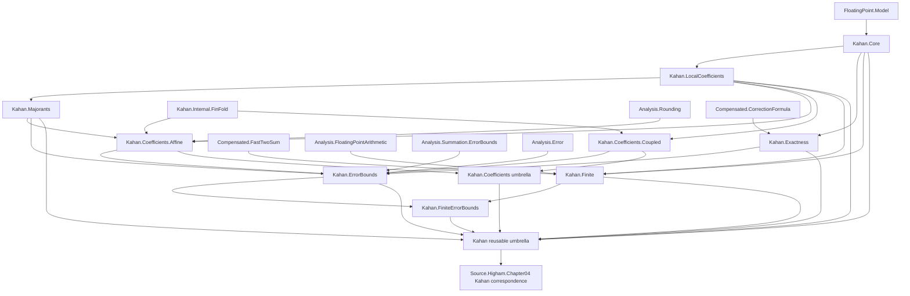

# Compensated-summation migration, phase 4C: ordinary Kahan

Date: 2026-07-23

## Scope and authority

This batch extracts the ordinary Kahan algorithm, its two coefficient engines,
finite-format realization, exactness results, and reusable error-bound API from
`NumStability.Algorithms.Summation.Compensated`. It also moves the interleaved
Higham equations (4.8)--(4.9) model-strength audits, counterexamples, corrected
bounds, and finite-family correspondence into the canonical Chapter 4 source
hierarchy.

Base revision for the staged phase-4 worktree:
`312a970cddfb5c41da81237bb34b5cb5fd0c93e4`.

This record is based on the declaration order at that revision and on the
compiled declaration-dependency stream captured from it. Phase 4A and 4B
change line offsets in the monolith, so declaration names below, rather than
mutable line numbers, are the authoritative extraction anchors. Every range is
inclusive. Where one conceptual layer is interleaved with another, the table
lists each exact island separately.

Except for the private Fin-fold helper described below, all declarations remain
in namespace `NumStability`, retain their existing names, and keep their
statements and proofs unchanged.

## Canonical dependency graph



There is no `Affine -> Coupled` or `Coupled -> Affine` edge. The two engines
share only the local delta/coefficient layer, Kahan execution, and the small
internal fold bridge. Reusable modules never import `NumStability.Source`.

## Exact reusable declaration map

| Previous owner | Canonical owner | Exact inclusive declaration anchor | Role |
| --- | --- | --- | --- |
| `Algorithms.Summation.Compensated` | `Algorithms.Summation.Compensated.Kahan.Core` | `KahanState` through `KahanState.returnedFromTotalCorrection_totalCorrection` | persistent state and coordinate operations |
| same | same | `KahanStepTrace` through `kahanStep` | one-step trace and state transition |
| same | same | `kahanStepTrace_zero_of_exact_zero_path` through `kahanStep_zero_of_exact_zero_path` | source-independent initialization contract |
| same | same | `kahanStepTrace_temp` through `kahanStepTrace_e` | one-step execution API |
| same | same | `kahanPrefixState` through `kahanPrefixState_one_of_exact_zero_path` | prefix execution |
| same | same | `kahanTrace` | indexed trace projection |
| same | same | the individual definitions `fl_kahanState`, `fl_kahanSum`, and `fl_kahanCorrection` | final execution API; extracted from the interleaved finite block |
| same | same | the individual projection theorems `fl_kahanState_eq_prefixState`, `fl_kahanSum_eq_state_s`, and `fl_kahanCorrection_eq_state_e` | final-state API; the affine fold theorem between them is excluded |
| `Algorithms.Summation.Compensated` | `Algorithms.Summation.Compensated.Kahan.LocalCoefficients` | `KahanStepDeltaWitness` through `kahanStepDeltaWitness_e_abs_le_split` | local roundoff witnesses, scalar coefficients, cancellation identities, and local correction bounds |
| same | same | `kahanStepDeltaWitness_total_coefficients` through `kahanStepDeltaWitness_total_compensated_total_coefficients` | local total-coordinate coefficient identities |
| same | same | `kahanTrace_deltaWitness` through `kahanTrace_deltaWitness_total_compensated_total_coefficients` | indexed witness and coefficient projections |
| same | same | `KahanPrefixDeltaWitnessFamily` through `kahanPrefixDeltaWitnessFamilyOfExactSub` | supplied-witness family and exact-subtraction predicate; moved out of the coupled block |
| same | same | `kahanTrace_deltaWitness_deltaY_bound` through `kahanTrace_deltaWitness_deltaE_bound` | indexed primitive delta bounds |
| `Algorithms.Summation.Compensated` | `Algorithms.Summation.Compensated.Kahan.Majorants` | `kahanTrace_e_abs_le` through `kahanPrefixState_e_abs_le_inputMajorant` | local, prefix-recursive, and input-only absolute majorants |
| `Algorithms.Summation.Compensated` | `Algorithms.Summation.Compensated.Kahan.Coefficients.Affine` | `KahanAffineCoeffStep` through `kahanAffineCorrectionAbsUnroll_le_indexedBudget` | source-independent affine list algebra |
| same | same | `kahanAffineCoeffStepOfIndex` through `kahanAffineCoeffSteps_prefixTotal_sub_sum_inputCoeff_abs_le_inputMajorantBudget` | instantiation on Kahan traces and residual estimates before coefficient existence |
| same | same | the individual theorem `kahanAffineCoeffSteps_prefixSum_sub_sum_inputCoeff_abs_le_inputMajorantBudget` | returned-sum residual estimate; extracted around the first coefficient-existence bridge |
| same | same | the individual theorem `kahanAffineCoeffSteps_fold_zero_eq_final_total` | final affine fold bridge |
| `Algorithms.Summation.Compensated` | `Algorithms.Summation.Compensated.Kahan.Coefficients.Coupled` | `KahanCoupledCoeffStep` through `kahanCoupledCoeffSteps_sourceCoeff_s_abs_sub_one_le_two_u_plus_exactSubMajorant` | coupled state algebra and actual-step coefficient bounds |
| same | same | `kahanCoupledCoeffStepsOfWitnesses` through `kahanCoupledCoeffStepsOfWitnesses_prefixState_total_eq_sum_sourceTotalCoeff` | supplied-witness coupled realization; the three local-family declarations listed above are excluded |
| `Algorithms.Summation.Compensated` | `Algorithms.Summation.Compensated.Kahan.Finite` | `finiteKahanStepTrace` through `finiteKahanStep` | finite round-to-even execution |
| same | same | `finiteKahanStepTrace_temp` through `finiteKahanStep_zero_of_finiteSystem` | finite step API and initialization |
| same | same | `finiteKahanPrefixState` through `finiteKahanPrefixState_one_of_finiteSystem` | finite prefix execution |
| same | same | the individual definitions `finiteKahanTrace`, `finiteKahanState`, `finiteKahanSum`, and `finiteKahanCorrection` | finite indexed and final API |
| same | same | `finiteKahanStepTrace_y_finiteSystem` through `KahanPrefixCorrectionSubExact.of_finiteRoundToEven_fastTwoSumCertificates` | finite-system closure, realization, and exact-subtraction certificates |
| `Algorithms.Summation.Compensated` | `Algorithms.Summation.Compensated.Kahan.Exactness` | `kahanStepTrace_correctionFormulaTrace` through `kahanStep_compensated_total_eq_of_exact_y_and_correction` | local exact correction invariant |
| same | same | `kahanPrefixState_compensated_total_eq_sum_of_exact_steps` through `fl_kahanFinalCorrectedSum_exactWithUnitRoundoff` | prefix/final exactness and the final-correction variant |
| `Algorithms.Summation.Compensated` | `Algorithms.Summation.Compensated.Kahan.ErrorBounds` | the individual theorem `kahanAffineCoeffSteps_prefixTotal_exists_mu_inputCoeffResidual` | affine compensated-total residual-to-source-coefficient existence bridge |
| same | same | `kahanAffineCoeffSteps_prefixSum_exists_mu_inputCoeffResidual` through `kahanAffineCoeffSteps_prefixSum_exists_mu_abs_le_of_productRadius_and_residualBudget` | affine returned-sum residual-to-source-coefficient existence bridges |
| same | same | the individual theorem `fl_kahanSum_backward_error_source_bound_of_affine_residualBudget` | conditional affine backward bound |
| same | same | `fl_kahanSum_backward_error_source_bound_of_sourceCoeff_s_bound` through `fl_kahanSum_backward_error_source_bound_of_exactSubTrace` | coupled returned-sum backward bounds |
| same | same | the individual theorem `fl_kahanCompensatedTotal_backward_error_source_bound` | compensated-total backward representation |
| same | same | `kahan_backward_error_forward_bound_core` through `fl_kahanSum_forward_error_bound_of_backward` | generic backward-to-forward bridge |
| same | same | `fl_kahanSum_relError_le_of_backward_oneSigned` through `fl_kahanFinalCorrectedSum_relError_le_of_backward_oneSigned` | generic relative and final-correction forward consequences |
| `Algorithms.Summation.Compensated` | `Algorithms.Summation.Compensated.Kahan.FiniteErrorBounds` | `fl_kahanSum_backward_error_source_bound_of_finiteRoundToEven_sub_finite` through `fl_kahanSum_backward_error_source_bound_of_finiteRoundToEven_base2_tail_order_range` | finite round-to-even specializations of the reusable backward bound |
| new aggregate | `Algorithms.Summation.Compensated.Kahan.Coefficients` | declaration-free imports of `Affine` and `Coupled` | coefficient-family entry point |
| new aggregate | `Algorithms.Summation.Compensated.Kahan` | declaration-free imports of the supported Kahan leaves and `Coefficients` | reusable ordinary-Kahan entry point |

The exact-subtraction declarations
`KahanPrefixDeltaWitnessFamily`, `KahanPrefixCorrectionSubExact`, and
`kahanPrefixDeltaWitnessFamilyOfExactSub` must precede `Coupled`: leaving them
inside that engine would force the finite layer to import all coupled
coefficient machinery. The four `fl_kahan*` execution definitions and their
projections must similarly be lifted out of their present finite/affine
interleaving into `Core`.

The compiled dependency audit found that `LocalCoefficients` depends
externally only on `FloatingPoint.Model`; `Coupled` adds no other external
project dependency. `Finite` needs `FloatingPoint.Model` and
`Analysis.FloatingPointArithmetic`, plus the canonical Kahan/FastTwoSum
predecessors. The affine bound
`kahanAffineInputCoeffProductRadius_le_two_u_plus` directly uses
`Analysis.Rounding.one_add_pow_sub_one_le_two_mul_nat_mul_of_nat_mul_le_half`.
The four affine coefficient-existence theorems mapped to `ErrorBounds` use
`Analysis.Summation.ErrorBounds` and must not remain hidden transitive
dependencies of the coefficient leaf.

## Exact source-only declaration map

| Previous owner | Canonical owner | Exact declaration anchor | Source role |
| --- | --- | --- | --- |
| `Algorithms.Summation.Compensated` | `Source.Higham.Chapter04.Equation07.AbstractModelCounterexample` | `correctionFormulaAbstractCounterexampleFPModel` through `correctionFormulaAbstractCounterexample_not_exact` | abstract equation-(4.7) model counterexample deferred by phase 4B and required by the Kahan initialization audit |
| same | `Source.Higham.Chapter04.Algorithm02.InitializationModelLimitations` | `kahanStepTrace_abstractCounterexample_zero` through `kahanStep_abstractCounterexample_zero_ne_exact` | bare-model initialization limitation for Algorithm 4.2 |
| same | `Source.Higham.Chapter04.Equation08.ModelStrength` | `kahanBiasedSmallCounterexampleFPModel` through `kahanBiasedTwoStepInput`; `fl_kahanSum_biasedSmallCounterexample_twoStep` through `not_exists_higham48BareFPModelTwoTermSecondOrderBound`; and the individual theorem `not_forall_fl_kahanSum_backward_error_source_bound_bare_fpmodel_exactSubConstants` | common biased countermodel and equation-(4.8) backward-bound discrepancy |
| same | same | `not_kahanAffine_residualBudget_inputMajorant_one_of_Cu_le_one` through `not_exists_kahanAffine_residualBudget_inputMajorant_fixed_C` | failed affine residual-budget proof route for equation (4.8) |
| same | `Source.Higham.Chapter04.Equation09.ModelStrength` | `not_fl_kahanSum_biasedSmallCounterexample_twoStep_forward_bound_of_Cu_le_half` through `not_exists_higham49BareFPModelTwoTermSecondOrderBound` | corresponding equation-(4.9) forward-bound discrepancy |
| same | `Source.Higham.Chapter04.Equation08.ReturnedSum` | `highamCh4KahanReturnedCounterexampleX1` through `highamCh4KahanReturnedCounterexampleP5_no_source_bound_one_sixteenth_actual` | P5 counterexample, suffix audit, corrected leading-`3u` bound, and checked terminals for the ordinary returned coordinate |
| same | `Source.Higham.Chapter04.Equation08.FiniteRouteLimitations` | `not_forall_finiteKahanTrace_tail_abs_order` through `finiteKahanTrace_tail_direct_sub_finiteNormalRange_not_finiteSystem_counterexample` | failed finite exact-subtraction shortcut hypotheses |
| same | `Source.Higham.Chapter04.Equation08.ReturnedSum` | the individual alias `highamCh4_equation48_modelStrengthCorrection_bareFPModel` | source-facing corrected equation-(4.8) terminal |
| same | `Source.Higham.Chapter04.Equation09.Correction` | the individual theorem `fl_kahanSum_forward_error_bound_correctedReturnedMajorant` and alias `highamCh4_equation49_modelStrengthCorrection_bareFPModel` | corrected equation-(4.9) forward terminal |
| `Algorithms.Ch4KahanFiniteFamily` | `Source.Higham.Chapter04.Equation08.FiniteFamily` | the complete declaration set, `highamCh4KahanFiniteFamilyFormat` through `highamCh4_equation49_finiteFamily_no_fixed_secondOrderConstant` | genuine finite binary family shared by the equation-(4.8) backward and equation-(4.9) forward audits |
| new source aggregate | `Source.Higham.Chapter04.Algorithm02` | declaration-free import of `InitializationModelLimitations` | Algorithm 4.2 source entry point |
| new source aggregate | `Source.Higham.Chapter04.Equation08` | declaration-free imports of `ModelStrength`, `ReturnedSum`, `FiniteRouteLimitations`, and `FiniteFamily` | equation-(4.8) source entry point |
| new source aggregate | `Source.Higham.Chapter04.Equation09` | declaration-free imports of `ModelStrength`, `Correction`, and the shared equation-(4.8) finite-family leaf | equation-(4.9) source entry point |

The apparently generic declarations inside the returned-sum island remain
source-owned. In particular, the declarations whose names contain
`correctedSuffixMajorant`, `correctedReturnedMajorant`, and
`fl_kahanSum_backward_error_source_bound_correctedReturnedMajorant` depend on
the source-audit predicate `highamCh4KahanSuffixCounterexampleLocalFacts` and
encode the checked correction to Higham's printed ordinary-returned bound.
Moving them into reusable `Kahan.ErrorBounds` would reverse the intended
dependency direction and disguise a source correction as a general API.

`Source.Higham.Chapter04.Equation09` may import the shared finite-family leaf
owned by `Equation08`; the family is constructed for the backward statement
and the forward discrepancy is its direct consequence. No reusable module
imports either source entry point.

## Private-helper decision

The original private theorem `list_foldl_ofFn_eq_fin_foldl` is used by exactly
three bridges:

- `kahanCoupledCoeffSteps_fold_eq_finFold`;
- `kahanCoupledCoeffStepsOfWitnesses_fold_eq_finFold`;
- `kahanAffineCoeffSteps_fold_eq_finFold`.

A private declaration cannot cross the new affine/coupled module boundary.
Phase 4C moves its proof to
`Algorithms.Summation.Compensated.Kahan.Internal.FinFold` as the unsupported
declaration
`NumStability.Compensated.Kahan.Internal.listFoldlOfFn_eq_finFoldl` and updates
only those three proof references. This is the sole declaration rename and
visibility adjustment in the batch. It is permitted because the original is
private, is not part of any supported import surface, and the new declaration
remains owner-local under `Internal`. The public Kahan and coefficient
umbrellas do not directly import `Internal`.

## Import and consumer plan

- `Kahan.Core` imports `FloatingPoint.Model`; it does not import finite-format,
  error-bound, recursive-summation, or source modules.
- `Kahan.LocalCoefficients` imports `Kahan.Core` and the model explicitly.
- `Kahan.Majorants` imports `LocalCoefficients`.
- `Kahan.Coefficients.Affine` imports `LocalCoefficients`, `Majorants`, the
  internal fold bridge, and `Analysis.Rounding` for its explicit product
  estimate.
- `Kahan.Coefficients.Coupled` imports `LocalCoefficients` and the internal
  fold bridge. It does not import `Affine`.
- `Kahan.Finite` imports `Analysis.FloatingPointArithmetic`,
  `Compensated.FastTwoSum`, `Core`, and `LocalCoefficients`. It does not import
  either coefficient engine.
- `Kahan.Exactness` imports `Compensated.CorrectionFormula` and `Core`.
- `Kahan.ErrorBounds` explicitly imports `Analysis.Error`,
  `Analysis.Summation.ErrorBounds`, both coefficient engines, `Majorants`, and
  `Exactness`.
- `Kahan.FiniteErrorBounds` imports only the reusable `Finite` and
  `ErrorBounds` surfaces plus any direct tactic dependency required by the
  moved proofs.
- `Algorithms.Summation.Compensated` imports the reusable `Kahan` umbrella and
  the new Chapter 4 source entry points so its staged complete surface remains
  compatible while no-guard and alternative declarations still reside in the
  file.
- `Algorithms.Summation` continues to import the complete compensated family.
- `Algorithms.CompensatedSum` remains the documented import-only historical
  wrapper over `Algorithms.Summation.Compensated` and retains its isolated
  old-only test.
- `Algorithms.Ch4KahanFiniteFamily` becomes an import-only compatibility
  wrapper over `Source.Higham.Chapter04.Equation08.FiniteFamily`; its mapping
  is added to `COMPATIBILITY.md` and the tier manifest with the normal
  breaking-release removal policy.
- `Algorithms.KahanCompensatedFiniteFormat` is rebuilt as a downstream
  consumer but keeps its broad import until the equation-(4.10) alternative
  algorithm is migrated in the next compensated slice.
- `Source.Higham.Chapter04` imports the new `Algorithm02`, `Equation08`, and
  `Equation09` source umbrellas.

No production reusable consumer may import the complete compensated umbrella
after a narrower Kahan leaf supplies its declarations. Broad imports remain
only at documented complete, compatibility, or not-yet-migrated source-facing
surfaces.

## Compatibility and isolated tests

The batch must add and register canonical-only smoke modules for:

- `Kahan.Core`;
- `Kahan.LocalCoefficients`;
- `Kahan.Majorants`;
- `Kahan.Coefficients.Affine`;
- `Kahan.Coefficients.Coupled`;
- `Kahan.Finite`;
- `Kahan.Exactness`;
- `Kahan.ErrorBounds`;
- `Kahan.FiniteErrorBounds`;
- the complete reusable `Kahan` umbrella;
- `Source.Higham.Chapter04.Algorithm02`;
- `Source.Higham.Chapter04.Equation08`;
- `Source.Higham.Chapter04.Equation09`; and
- `Source.Higham.Chapter04.Equation08.FiniteFamily`.

Each reusable smoke module imports exactly one canonical surface and checks
representative declaration signatures from that layer. The source tests import
only their source entry point and therefore cannot receive declarations through
the complete compensated umbrella.

The existing old-only
`NumStabilityTest.Import.Compatibility.Summation.Compensated` test continues to
import only `NumStability.Algorithms.CompensatedSum` and checks representative
Core, FiniteErrorBounds, and Chapter 4 source declarations. A second old-only
test imports only `NumStability.Algorithms.Ch4KahanFiniteFamily` and checks both
finite-family terminal theorems. The canonical and historical imports may also
be compiled together in a migration smoke module, but that test does not
replace either isolated check.

## Build and verification plan

Build in dependency order:

```text
lake build NumStability.Algorithms.Summation.Compensated.Kahan.Core
lake build NumStability.Algorithms.Summation.Compensated.Kahan.LocalCoefficients
lake build NumStability.Algorithms.Summation.Compensated.Kahan.Majorants
lake build NumStability.Algorithms.Summation.Compensated.Kahan.Coefficients.Affine
lake build NumStability.Algorithms.Summation.Compensated.Kahan.Coefficients.Coupled
lake build NumStability.Algorithms.Summation.Compensated.Kahan.Finite
lake build NumStability.Algorithms.Summation.Compensated.Kahan.Exactness
lake build NumStability.Algorithms.Summation.Compensated.Kahan.ErrorBounds
lake build NumStability.Algorithms.Summation.Compensated.Kahan.FiniteErrorBounds
lake build NumStability.Algorithms.Summation.Compensated.Kahan
lake build NumStability.Source.Higham.Chapter04.Algorithm02
lake build NumStability.Source.Higham.Chapter04.Equation08
lake build NumStability.Source.Higham.Chapter04.Equation09
lake build NumStability.Source.Higham.Chapter04
```

Then build the compatibility and downstream surfaces:

```text
lake build NumStability.Algorithms.Summation.Compensated
lake build NumStability.Algorithms.Summation
lake build NumStability.Algorithms.CompensatedSum
lake build NumStability.Algorithms.Ch4KahanFiniteFamily
lake build NumStability.Algorithms.KahanCompensatedFiniteFormat
lake build NumStabilityTest.Import.Compatibility.Summation.Compensated
lake test
lake build NumStability NumStabilityTest
```

Completion evidence must also include:

1. a declaration ownership/count comparison proving that every public Kahan
   and moved source declaration remains available under the staged complete
   surface;
2. canonical-only and old-only isolated smoke builds;
3. `python tools/architecture/check_layout.py`;
4. `python tools/architecture/check_compatibility.py`;
5. `python tools/architecture/check_provenance.py`;
6. a dry run of `normalize_apache_notices.py` and aggregate-order checks;
7. a strict source/import capture with no reusable-to-source edge;
8. a full declaration-bearing architecture baseline and reproducibility
   check; and
9. `git diff --check` with no tracked generated output.

## K1 implementation checkpoint (2026-07-23)

K1 is implemented as the deliberately narrow first execution slice:

- `NumStability.Algorithms.Summation.Compensated.Kahan.Core` now owns the
  Kahan state, one-step trace and update, exact-zero-path bridge, assignment
  projections, prefix execution, indexed trace, final state/sum/correction,
  and final projection lemmas mapped to `Core` above;
- `NumStability.Algorithms.Summation.Compensated` imports that leaf, so the
  established complete surface preserves the same public declaration names;
- abstract and biased-model counterexamples, finite-format declarations,
  coefficient machinery, exactness results, bounds, and source-facing results
  remain in the transitional monolith; and
- `NumStabilityTest.Import.SummationCompensatedKahanCore` is registered in
  `NumStabilityTest.lean` and imports only the canonical Core leaf before
  checking representative declarations from every part of the extracted API.

Targeted validation completed successfully on 2026-07-23:

```text
lake build NumStability.Algorithms.Summation.Compensated.Kahan.Core
  Built NumStability.Algorithms.Summation.Compensated.Kahan.Core
  Build completed successfully (1467 jobs).

lake build NumStabilityTest.Import.SummationCompensatedKahanCore
  Built NumStabilityTest.Import.SummationCompensatedKahanCore
  Build completed successfully (1468 jobs).
```

The complete compensated monolith, the future Kahan family umbrella, later
Kahan layers, and architecture manifests were intentionally not built or
changed at the K1 checkpoint.

### K2a local-coefficient checkpoint (2026-07-23)

K2a extracts the source-independent local coefficient layer exactly as mapped
above:

- `NumStability.Algorithms.Summation.Compensated.Kahan.LocalCoefficients`
  now owns the one-step delta-witness block, the two local total-coordinate
  identities, the indexed witness and coefficient projections, the explicit
  prefix witness family and exact-subtraction predicate, and the four indexed
  primitive delta-bound projections;
- `NumStability.Algorithms.Summation.Compensated` imports the new leaf, so the
  established complete surface continues to expose the same public names;
- Majorants, Affine, Coupled, Finite, Exactness, error bounds, and source-only
  declarations remain in the transitional monolith; and
- `NumStabilityTest.Import.SummationCompensatedKahanLocalCoefficients` is
  registered in `NumStabilityTest.lean` and directly imports only the new
  canonical leaf before checking each extracted API island.

Targeted K2a validation completed successfully on 2026-07-23:

```text
lake build NumStability.Algorithms.Summation.Compensated.Kahan.LocalCoefficients
  Built NumStability.Algorithms.Summation.Compensated.Kahan.LocalCoefficients
  Build completed successfully (1468 jobs).

lake build NumStabilityTest.Import.SummationCompensatedKahanLocalCoefficients
  Built NumStabilityTest.Import.SummationCompensatedKahanLocalCoefficients
  Build completed successfully (1469 jobs).
```

The complete compensated monolith, Kahan family umbrella, later Kahan layers,
and architecture manifests were intentionally not built or changed at K2a.
They remain subject to the staged validation plan above.

### K2b majorants checkpoint (2026-07-23)

K2b extracts the single contiguous majorant island exactly as mapped above:

- `NumStability.Algorithms.Summation.Compensated.Kahan.Majorants` now owns
  `kahanTrace_e_abs_le` through
  `kahanPrefixState_e_abs_le_inputMajorant`, including the local stored-sum
  estimate, recursive correction majorant, and coupled input-only majorants;
- `NumStability.Algorithms.Summation.Compensated` imports the new leaf, so the
  established complete surface continues to expose the same public names;
- the private `list_foldl_ofFn_eq_fin_foldl` helper and all Affine, Coupled,
  Finite, Exactness, error-bound, and source-only declarations remain in the
  transitional monolith; and
- `NumStabilityTest.Import.SummationCompensatedKahanMajorants` is registered
  in `NumStabilityTest.lean` and imports only the canonical Majorants leaf
  before checking every majorant sub-API.

Targeted K2b validation completed successfully on 2026-07-23:

```text
lake build NumStability.Algorithms.Summation.Compensated.Kahan.Majorants
  Built NumStability.Algorithms.Summation.Compensated.Kahan.Majorants
  Build completed successfully (1469 jobs).

lake build NumStabilityTest.Import.SummationCompensatedKahanMajorants
  Built NumStabilityTest.Import.SummationCompensatedKahanMajorants
  Build completed successfully (1470 jobs).
```

The complete compensated monolith, Kahan family umbrella, later Kahan layers,
and architecture manifests were intentionally not built or changed at K2b.
They remain subject to the staged validation plan above.

### K2c internal FinFold checkpoint (2026-07-23)

K2c implements the private-helper decision recorded above without extracting
either coefficient engine:

- `NumStability.Algorithms.Summation.Compensated.Kahan.Internal.FinFold` now
  owns the former private proof as the unsupported declaration
  `NumStability.Compensated.Kahan.Internal.listFoldlOfFn_eq_finFoldl`;
- the old private declaration was removed from
  `NumStability.Algorithms.Summation.Compensated`, which imports the internal
  module and uses the fully qualified new name at exactly the three documented
  Affine/Coupled bridge proofs;
- the theorem is externally checkable even though it is unsupported, so the
  minimal direct smoke test
  `NumStabilityTest.Import.SummationCompensatedKahanInternalFinFold` is
  registered in `NumStabilityTest.lean`; and
- no Affine or Coupled public declaration moved in this checkpoint.

Targeted K2c validation completed successfully on 2026-07-23:

```text
lake build NumStability.Algorithms.Summation.Compensated.Kahan.Internal.FinFold
  Built NumStability.Algorithms.Summation.Compensated.Kahan.Internal.FinFold
  Build completed successfully (552 jobs).

lake build NumStabilityTest.Import.SummationCompensatedKahanInternalFinFold
  Built NumStabilityTest.Import.SummationCompensatedKahanInternalFinFold
  Build completed successfully (553 jobs).

lake build NumStability.Algorithms.Summation.Compensated
  Built NumStability.Algorithms.Summation.Compensated
  Build completed successfully (1492 jobs).
```

The final monolith build is the integration evidence that all three rewritten
helper references elaborate together.  The Kahan family umbrella, later Kahan
extractions, and architecture manifests remain deferred to the staged plan.

### K3a coupled-coefficient checkpoint (2026-07-23)

K3a extracts the two Coupled islands exactly as mapped above:

- `NumStability.Algorithms.Summation.Compensated.Kahan.Coefficients.Coupled`
  now owns `KahanCoupledCoeffStep` through the final ordinary actual-trace
  bound and `kahanCoupledCoeffStepsOfWitnesses` through the final
  supplied-witness prefix-total identity;
- the exact-subtraction witness-family declarations remain owned only by
  `Kahan.LocalCoefficients`; they were not copied into the Coupled leaf;
- the leaf imports only Kahan Core, LocalCoefficients, and Internal.FinFold as
  project dependencies, plus the directly used Mathlib tactic modules and
  `Mathlib.Algebra.BigOperators.Fin` for `Fin.sum_univ_succ`;
- `NumStability.Algorithms.Summation.Compensated` imports the canonical leaf,
  while the Affine declarations and their sole remaining FinFold reference
  remain in the transitional monolith; and
- `NumStabilityTest.Import.SummationCompensatedKahanCoefficientsCoupled` is
  registered in `NumStabilityTest.lean` and directly checks representative
  state algebra, actual-trace, exact-subtraction, supplied-witness, fold, and
  final prefix-realization declarations.

The first isolated build exposed the previously transitive
`Fin.sum_univ_succ` dependency.  Adding its direct owning Mathlib import was
the only dependency correction; no declaration or proof changed.  Final K3a
validation completed successfully on 2026-07-23:

```text
lake build NumStability.Algorithms.Summation.Compensated.Kahan.Coefficients.Coupled
  Built NumStability.Algorithms.Summation.Compensated.Kahan.Coefficients.Coupled
  Build completed successfully (1472 jobs).

lake build NumStabilityTest.Import.SummationCompensatedKahanCoefficientsCoupled
  Built NumStabilityTest.Import.SummationCompensatedKahanCoefficientsCoupled
  Build completed successfully (1473 jobs).
```

The coefficient-family and Kahan umbrellas, Affine extraction, finite and
source layers, and architecture manifests remain deferred to later stages.

### K3b affine-coefficient checkpoint (2026-07-23)

K3b extracts the four Affine islands exactly as mapped above:

- `NumStability.Algorithms.Summation.Compensated.Kahan.Coefficients.Affine`
  now owns the base affine list algebra, indexed Kahan realization and
  prefix-total residual estimate, the individual returned-prefix residual
  estimate, and the final compensated-total fold bridge;
- the four `kahanAffineCoeffSteps_*exists_mu*` coefficient-existence bridges
  remain in the transitional monolith for the future ErrorBounds leaf, and
  the bare-model/source affine residual-budget declarations also remain there;
- the leaf imports Kahan Core, LocalCoefficients, Majorants, and
  Internal.FinFold, together with the directly used Analysis.Rounding and
  tactic modules;
- `NumStability.Algorithms.Summation.Compensated` imports the canonical Affine
  leaf, and its last direct internal FinFold use moved with the Affine proof;
  and
- `NumStabilityTest.Import.SummationCompensatedKahanCoefficientsAffine` is
  registered in `NumStabilityTest.lean` and directly checks each extracted
  affine API island without importing Coupled, ErrorBounds, finite, or source
  layers.

Targeted K3b validation completed successfully on 2026-07-23:

```text
lake build NumStability.Algorithms.Summation.Compensated.Kahan.Coefficients.Affine
  Built NumStability.Algorithms.Summation.Compensated.Kahan.Coefficients.Affine
  Build completed successfully (1474 jobs).

lake build NumStabilityTest.Import.SummationCompensatedKahanCoefficientsAffine
  Built NumStabilityTest.Import.SummationCompensatedKahanCoefficientsAffine
  Build completed successfully (1475 jobs).
```

The coefficient-family and Kahan umbrellas, ErrorBounds extraction, finite and
source layers, and architecture manifests remain deferred to later stages.

### K4a finite execution and certificates checkpoint (2026-07-23)

K4a extracts every finite execution and certificate island mapped above:

- `NumStability.Algorithms.Summation.Compensated.Kahan.Finite` now owns the
  finite step definitions, projections, and exact first-step lemmas; finite
  prefix execution and initialization; finite indexed/final definitions; and
  the complete finite-system, realization, and correction-subtraction
  certificate range through
  `KahanPrefixCorrectionSubExact.of_finiteRoundToEven_fastTwoSumCertificates`;
- the leaf directly imports FloatingPointArithmetic, FastTwoSum, Kahan Core,
  and LocalCoefficients, plus the Ring tactic used by the unchanged proofs;
- `NumStability.Algorithms.Summation.Compensated` imports the canonical finite
  leaf, preserving the established complete surface;
- every finite backward-bound specialization and all finite-route/source
  counterexamples remain in the transitional monolith; and
- `NumStabilityTest.Import.SummationCompensatedKahanFinite` is registered in
  `NumStabilityTest.lean` and directly checks representative declarations from
  all five extracted finite API islands.

Targeted K4a validation completed successfully on 2026-07-23:

```text
lake build NumStability.Algorithms.Summation.Compensated.Kahan.Finite
  Built NumStability.Algorithms.Summation.Compensated.Kahan.Finite
  Build completed successfully (1478 jobs).

lake build NumStabilityTest.Import.SummationCompensatedKahanFinite
  Built NumStabilityTest.Import.SummationCompensatedKahanFinite
  Build completed successfully (1479 jobs).
```

FiniteErrorBounds, reusable ErrorBounds and Exactness extraction, the Kahan
umbrella, source migration, and architecture-manifest updates remain deferred.

### K4b exactness checkpoint (2026-07-23)

K4b extracts the two source-independent Exactness islands exactly as mapped:

- `NumStability.Algorithms.Summation.Compensated.Kahan.Exactness` now owns the
  local correction-formula identity and compensated-total invariant, plus the
  prefix/final exact-step chain, appended final-correction definitions and
  projections, and exact-arithmetic specializations through
  `fl_kahanFinalCorrectedSum_exactWithUnitRoundoff`;
- the leaf has only CorrectionFormula and Kahan Core as project dependencies,
  with direct BigOperators.Fin and Ring imports required by the unchanged sum
  induction proofs;
- `NumStability.Algorithms.Summation.Compensated` imports the canonical leaf,
  preserving the established complete surface;
- generic error-bound results, Problem 4.10 material, and every source-facing
  Higham declaration remain in the transitional monolith; and
- `NumStabilityTest.Import.SummationCompensatedKahanExactness` is registered
  in `NumStabilityTest.lean` and directly checks the local, prefix, final-state,
  final-correction, and exact-arithmetic APIs.

Targeted K4b validation completed successfully on 2026-07-23:

```text
lake build NumStability.Algorithms.Summation.Compensated.Kahan.Exactness
  Built NumStability.Algorithms.Summation.Compensated.Kahan.Exactness
  Build completed successfully (1471 jobs).

lake build NumStabilityTest.Import.SummationCompensatedKahanExactness
  Built NumStabilityTest.Import.SummationCompensatedKahanExactness
  Build completed successfully (1472 jobs).
```

Reusable ErrorBounds and FiniteErrorBounds extraction, the Kahan umbrella,
source migration, and architecture-manifest updates remain deferred.

### K5a reusable error-bounds checkpoint (2026-07-23)

K5a extracts every reusable, source-independent ErrorBounds island mapped
above:

- `NumStability.Algorithms.Summation.Compensated.Kahan.ErrorBounds` now owns
  the four affine coefficient-existence bridges, the affine residual-budget
  backward bound, the supplied coupled-source/witness/exact-subtraction
  backward-bound range, the compensated-total backward bound, and the generic
  backward-to-forward, relative-error, and final-correction consequences;
- the leaf directly imports Analysis.Error, Analysis.Summation.ErrorBounds,
  Affine, Coupled, Core, Exactness, LocalCoefficients, and Majorants, together
  with the Linarith and Ring tactics used by the unchanged proofs;
- `NumStability.Algorithms.Summation.Compensated` imports the canonical leaf,
  preserving the established complete surface;
- every bare-model or biased result, every corrected-returned-majorant and
  `highamCh4*` declaration, and every finiteRoundToEven specialization remains
  in the transitional monolith for its mapped finite or source-facing layer;
  and
- `NumStabilityTest.Import.SummationCompensatedKahanErrorBounds` is registered
  in `NumStabilityTest.lean` and directly checks declarations from every
  extracted reusable bounds island.

Targeted K5a validation completed successfully on 2026-07-23:

```text
lake build NumStability.Algorithms.Summation.Compensated.Kahan.ErrorBounds
  Built NumStability.Algorithms.Summation.Compensated.Kahan.ErrorBounds
  Build completed successfully (1481 jobs).

lake build NumStabilityTest.Import.SummationCompensatedKahanErrorBounds
  Built NumStabilityTest.Import.SummationCompensatedKahanErrorBounds
  Build completed successfully (1482 jobs).
```

FiniteErrorBounds extraction, the Kahan umbrella, source migration, and
architecture-manifest updates remain deferred.

### K5b finite error-bounds checkpoint (2026-07-23)

K5b extracts the complete finite specialization range mapped above:

- `NumStability.Algorithms.Summation.Compensated.Kahan.FiniteErrorBounds` now
  owns the ten finite round-to-even backward-bound routes from direct finite
  subtraction through tail-only base-2 order/range certificates;
- the leaf imports only Kahan ErrorBounds and Kahan Finite; the unchanged
  proofs require no additional tactic module;
- `NumStability.Algorithms.Summation.Compensated` imports the canonical leaf,
  preserving the established complete surface;
- every finite counterexample, limitation theorem, and source-facing audit
  remains in the transitional monolith; and
- `NumStabilityTest.Import.SummationCompensatedKahanFiniteErrorBounds` is
  registered in `NumStabilityTest.lean` and directly checks all ten extracted
  finite specialization declarations.

Targeted K5b validation completed successfully on 2026-07-23:

```text
lake build NumStability.Algorithms.Summation.Compensated.Kahan.FiniteErrorBounds
  Built NumStability.Algorithms.Summation.Compensated.Kahan.FiniteErrorBounds
  Build completed successfully (1490 jobs).

lake build NumStabilityTest.Import.SummationCompensatedKahanFiniteErrorBounds
  Built NumStabilityTest.Import.SummationCompensatedKahanFiniteErrorBounds
  Build completed successfully (1491 jobs).
```

The Kahan umbrella, source migration, and architecture-manifest updates remain
deferred.

### K6a equation-(4.7) and initialization-source checkpoint (2026-07-23)

K6a moves the first two source-only islands out of the transitional algorithm
surface:

- `Source.Higham.Chapter04.Equation07.AbstractModelCounterexample` now owns
  `correctionFormulaAbstractCounterexampleFPModel` and its magnitude and
  non-exactness results;
- `Source.Higham.Chapter04.Algorithm02.InitializationModelLimitations` now owns
  the three bare-model first-step limitations from
  `kahanStepTrace_abstractCounterexample_zero` through
  `kahanStep_abstractCounterexample_zero_ne_exact`;
- the declaration-free `Source.Higham.Chapter04.Algorithm02` umbrella was
  added, Equation07 now imports its new source leaf, and the Chapter04
  aggregate imports Algorithm02;
- the transitional Compensated module directly imports the two exact source
  leaves, preserving its established complete surface without pulling the
  broader Equation07 aggregate back into the reusable hierarchy;
- direct leaf-only and aggregate-only smoke modules were added and registered
  for Algorithm02 and Equation07, and the existing Chapter04 aggregate smoke
  now checks both new source routes; and
- the biased countermodel and all equation-(4.8), equation-(4.9), finite
  counterexample, and returned-sum blocks remain untouched in Compensated.

Targeted K6a validation completed successfully on 2026-07-23:

```text
lake build NumStability.Source.Higham.Chapter04.Equation07.AbstractModelCounterexample
  Build completed successfully (1468 jobs).

lake build NumStability.Source.Higham.Chapter04.Algorithm02.InitializationModelLimitations
  Build completed successfully (1470 jobs).

lake build NumStability.Source.Higham.Chapter04.Algorithm02 \
  NumStability.Source.Higham.Chapter04.Equation07 \
  NumStability.Source.Higham.Chapter04
  Build completed successfully (2137 jobs).

lake build NumStabilityTest.Import.Source.Chapter04.Algorithm02 \
  NumStabilityTest.Import.Source.Chapter04.Algorithm02InitializationModelLimitations \
  NumStabilityTest.Import.Source.Chapter04.Equation07 \
  NumStabilityTest.Import.Source.Chapter04.Equation07AbstractModelCounterexample \
  NumStabilityTest.Import.Source.Chapter04
  Build completed successfully (2142 jobs).
```

Equation-(4.8)/(4.9) source migration and architecture-manifest updates remain
deferred.

### K6b equation-(4.8)/(4.9) model-strength checkpoint (2026-07-23)

K6b moves the bare-model and biased-countermodel audits into their exact
source owners:

- `Source.Higham.Chapter04.Equation08.ModelStrength` now owns the shared
  biased model and input, the failed affine residual-budget route, the complete
  two-step backward-discrepancy and Higham48 quantifier range, and the
  individual exact-subtraction-constants nonexistence theorem;
- `Source.Higham.Chapter04.Equation09.ModelStrength` now owns only the
  supplied-backward forward-error obstruction, the Higham49 predicate, and its
  uniform nonexistence theorem, importing Equation08 ModelStrength for the
  shared countermodel and small-unit-roundoff witness;
- both leaves directly import their used big-operator/tactic surfaces, and
  Equation08 directly imports Kahan Affine and Core while Equation09 directly
  imports Kahan Core;
- declaration-free Equation08 and Equation09 umbrellas were added and the
  Chapter04 aggregate imports both; the transitional Compensated module
  directly imports the two exact ModelStrength leaves;
- leaf-only and aggregate-only smokes were added and registered for both
  equations, with exhaustive checks for all eleven Equation08 and all three
  Equation09 declarations; and
- every P5/returned-sum declaration, corrected-returned-majorant result, and
  finite-route limitation remains in Compensated for its later mapped source
  owner.

Targeted K6b validation completed successfully on 2026-07-23:

```text
lake build NumStability.Source.Higham.Chapter04.Equation08.ModelStrength \
  NumStability.Source.Higham.Chapter04.Equation09.ModelStrength
  Build completed successfully (1478 jobs).

lake build NumStability.Source.Higham.Chapter04.Equation08 \
  NumStability.Source.Higham.Chapter04.Equation09 \
  NumStability.Source.Higham.Chapter04
  Build completed successfully (2145 jobs).

lake build NumStabilityTest.Import.Source.Chapter04.Equation08 \
  NumStabilityTest.Import.Source.Chapter04.Equation08ModelStrength \
  NumStabilityTest.Import.Source.Chapter04.Equation09 \
  NumStabilityTest.Import.Source.Chapter04.Equation09ModelStrength \
  NumStabilityTest.Import.Source.Chapter04
  Build completed successfully (2150 jobs).
```

Returned-sum, finite-route, finite-family, corrected-forward, and remaining
source migration work remains deferred.

### K6c returned-sum correction checkpoint (2026-07-23)

K6c moves the ordinary returned-coordinate correction into its exact source
owners:

- `Source.Higham.Chapter04.Equation08.ReturnedSum` now owns the complete
  75-declaration island from
  `highamCh4KahanReturnedCounterexampleX1` through
  `highamCh4KahanReturnedCounterexampleP5_no_source_bound_one_sixteenth_actual`,
  including the concrete p=5 finite trace, the symbolic suffix audit, and the
  source-honest leading-`3u` backward representation;
- the same equation-(4.8) leaf owns the individual corrected terminal
  `highamCh4_equation48_modelStrengthCorrection_bareFPModel`;
- `Source.Higham.Chapter04.Equation09.Correction` owns
  `fl_kahanSum_forward_error_bound_correctedReturnedMajorant` and
  `highamCh4_equation49_modelStrengthCorrection_bareFPModel`, importing the
  equation-(4.8) returned-sum theorem rather than duplicating its proof route;
- the declaration-free Equation08 and Equation09 umbrellas import their new
  leaves, and the transitional Compensated surface imports the exact leaves so
  every established declaration name remains available;
- direct leaf-only smoke modules were added and registered, while the
  equation, Chapter04, canonical summation, complete aggregate, and old-only
  compatibility smokes now check both corrected terminals; and
- the old-only checks exposed and repaired a prior missing re-export of
  `Equation07.NoGuardCounterexample` from the transitional complete
  Compensated surface.

The ownership audit found exactly one defining occurrence for each first/last
anchor and corrected terminal after extraction. The finite-route limitation
range and all Phase 4D declarations remain in Compensated unchanged.

Targeted K6c validation completed successfully on 2026-07-23:

```text
lake build NumStability.Source.Higham.Chapter04.Equation08.ReturnedSum \
  NumStability.Source.Higham.Chapter04.Equation09.Correction
  Build completed successfully (1493 jobs).

lake build NumStabilityTest.Import.Source.Chapter04.Equation08ReturnedSum \
  NumStabilityTest.Import.Source.Chapter04.Equation09Correction \
  NumStability.Source.Higham.Chapter04.Equation08 \
  NumStability.Source.Higham.Chapter04.Equation09 \
  NumStability.Source.Higham.Chapter04 \
  NumStabilityTest.Import.Source.Chapter04.Equation08 \
  NumStabilityTest.Import.Source.Chapter04.Equation09 \
  NumStabilityTest.Import.Source.Chapter04 \
  NumStabilityTest.Import.SummationCanonical
  Build completed successfully (3188 jobs).

lake build NumStability.Algorithms.Summation.Compensated \
  NumStability.Algorithms.Summation \
  NumStabilityTest.Import.Compatibility.Summation.Compensated \
  NumStabilityTest.Import.SummationAggregate
  Build completed successfully (3179 jobs).

lake build NumStability.Algorithms.Ch4KahanFiniteFamily \
  NumStability.Algorithms.KahanCompensatedFiniteFormat
  Build completed successfully (1508 jobs; existing linter warnings only).
```

Finite-family ownership remains for K6e.

### K6d finite-route limitations checkpoint (2026-07-23)

K6d moves the six failed finite exact-subtraction shortcut routes into
`Source.Higham.Chapter04.Equation08.FiniteRouteLimitations`:

- the exact inclusive range runs from
  `not_forall_finiteKahanTrace_tail_abs_order` through
  `finiteKahanTrace_tail_direct_sub_finiteNormalRange_not_finiteSystem_counterexample`;
- the leaf imports FinCases and NormNum directly, together with
  `Analysis.FloatingPointArithmetic` and the reusable `Kahan.Finite`
  execution surface;
- the Equation08 umbrella and transitional Compensated complete surface import
  the exact source leaf, while no reusable Kahan module imports source code;
- the isolated leaf smoke checks all six declarations, and the Equation08,
  Chapter04, canonical, complete aggregate, and old-only compatibility tests
  check the first and final route limitations; and
- the ordinary no-guard section remains the first declaration-bearing section
  in Compensated after extraction.

The ownership audit found exactly one defining occurrence for each of the six
theorems, all in the new source leaf.

Targeted K6d validation completed successfully on 2026-07-23:

```text
lake build NumStability.Source.Higham.Chapter04.Equation08.FiniteRouteLimitations \
  NumStabilityTest.Import.Source.Chapter04.Equation08FiniteRouteLimitations
  Build completed successfully (1481 jobs).

lake build NumStability.Source.Higham.Chapter04.Equation08 \
  NumStability.Source.Higham.Chapter04 \
  NumStabilityTest.Import.Source.Chapter04.Equation08 \
  NumStabilityTest.Import.Source.Chapter04 \
  NumStability.Algorithms.Summation.Compensated \
  NumStabilityTest.Import.Compatibility.Summation.Compensated \
  NumStabilityTest.Import.SummationCanonical \
  NumStabilityTest.Import.SummationAggregate
  Build completed successfully (3190 jobs).
```

### K6e finite-family checkpoint (2026-07-23)

K6e completes the Phase 4C finite-family ownership move:

- the full 67-declaration implementation, comprising 16 public declarations
  and 51 private helpers, now lives in
  `Source.Higham.Chapter04.Equation08.FiniteFamily`;
- every declaration name, statement, proof, and private helper is unchanged,
  and a normalized body comparison against the historical implementation is
  exact;
- the canonical leaf uses the audited narrow imports for finite arithmetic,
  the reusable Kahan finite execution layer, the returned-sum source audit,
  and its direct Mathlib tactics;
- `Algorithms.Ch4KahanFiniteFamily` is now a documented, declaration-free
  compatibility module containing exactly one canonical import;
- the Equation08 and Equation09 umbrellas both expose the shared finite family,
  while the historical Algorithms aggregate consumes the canonical Chapter04
  source entry point instead of the old path;
- the compatibility and tier manifests record the old-to-new mapping, the old
  path was removed from the legacy naming and unclassified exception sets, and
  the Algorithms direct Source-import ceiling was ratcheted from two to three;
  and
- the canonical-only smoke checks all 16 public declarations, while the
  isolated old-only smoke checks both terminal theorems. The Equation08,
  Equation09, Chapter04, and Algorithms entry-point smokes check the same
  terminal surface.

The ownership audit found exactly 67 declarations in the canonical leaf,
exactly one defining occurrence of each public declaration, and no declaration
or production consumer in the historical wrapper.

Targeted K6e validation completed successfully on 2026-07-23:

```text
lake build NumStability.Source.Higham.Chapter04.Equation08.FiniteFamily
  Build completed successfully (1493 jobs; moved linter warnings only).

lake build NumStabilityTest.Import.Source.Chapter04.Equation08FiniteFamily
  Build completed successfully (1494 jobs; all 16 public checks elaborate).

lake build NumStability.Source.Higham.Chapter04.Equation08 \
  NumStability.Source.Higham.Chapter04.Equation09 \
  NumStabilityTest.Import.Source.Chapter04.Equation08 \
  NumStabilityTest.Import.Source.Chapter04.Equation09
  Build completed successfully (1502 jobs).

lake build NumStability.Source.Higham.Chapter04 \
  NumStabilityTest.Import.Source.Chapter04 \
  NumStability.Algorithms.Ch4KahanFiniteFamily \
  NumStabilityTest.Import.Compatibility.Source.Chapter04.AlgorithmsCh4KahanFiniteFamily
  Build completed successfully (2157 jobs).

lake build NumStability.Algorithms \
  NumStabilityTest.Import.Algorithms \
  NumStability.Algorithms.KahanCompensatedFiniteFormat
  Build completed successfully (4571 jobs; existing linter warnings only).

lake build NumStabilityTest
  Build completed successfully (4832 jobs; existing linter warnings only).

python tools/architecture/check_compatibility.py
  compatibility contract passed: 45 forwarding modules, 46 canonical targets

python tools/architecture/check_provenance.py
  provenance contract passed: 148 Apache-marked production files and
  5 evidenced upstream modules
```

The layout audit reports only the already documented transitional
`Algorithms.Summation.Compensated` declaration-bearing complete surface. That
module remains intentionally mixed until the Phase 4D slices listed below; K6e
adds no layout violation, unclassified module, mixed module, or unsorted
aggregate.

## Risks and safeguards

- **Source/reusable reversal.** The corrected returned-sum theorems look
  generic by name but depend on a Higham-specific audit predicate. The exact
  source table is authoritative; reusable error bounds must not import them.
- **Hidden transitive imports.** The monolith currently supplies model,
  finite-format, rounding, error, summation-bound, recursive-summation, and
  tactic declarations transitively. Each leaf receives the direct imports
  listed above before its block is removed from the monolith.
- **Private helper leakage.** Only the three documented fold proofs may use the
  new owner-local internal theorem. No source or public aggregate imports the
  internal module directly.
- **Predicate placement cycle.** `KahanPrefixCorrectionSubExact` and its
  witness-family prerequisites move below `Finite` and `Coupled`; otherwise
  finite exactness would pull in the coupled engine or create a cycle.
- **Model-strength confusion.** The abstract `FPModel` discrepancies do not
  refute correctly rounded finite arithmetic. Module docstrings must preserve
  that distinction, and the finite-route limitations remain separate from the
  bare-model counterexamples.
- **Compatibility masking.** Old-only tests import no canonical or sibling
  aggregate that could supply the same declarations independently.
- **Oversized mechanical move.** Extraction proceeds in the DAG order above.
  Core and local layers are built before either coefficient engine; finite and
  exactness are built before bounds; source leaves move only after their
  reusable dependencies compile.
- **Concurrent phase offsets.** Phase 4A/4B line movement must not be used to
  select blocks mechanically. Extraction uses the named first/last
  declarations and reviews the adjacent declarations after each move.

## Deferred work

Phase 4C does not migrate:

- ordinary Kahan under the no-guard model beginning at
  `kahanNoGuardStepTrace`;
- the separately accumulated alternative compensated algorithm beginning at
  `AlternativeCompensatedStepTrace`;
- Kahan's modified no-guard correction beginning at `kahanSameSign`;
- the equation-(4.10) implementation and source correspondence currently in
  `Algorithms.KahanCompensatedFiniteFormat`;
- public declaration renames or a modern `module`/`public import` conversion;
  or
- removal of any established compatibility wrapper.

`Algorithms.Summation.Compensated` therefore remains a transitional mixed
complete surface after this batch. It becomes a declaration-free complete
umbrella only after the no-guard, alternative, modified-correction, and
equation-(4.10) slices are migrated and independently validated.
