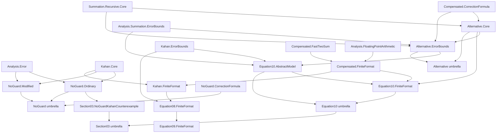

# Compensated-summation migration, phase 4D: variants and equation (4.10)

Date: 2026-07-23

## Scope and authority

This batch finishes the declaration split of
`NumStability.Algorithms.Summation.Compensated`. It extracts the ordinary and
modified no-guard Kahan variants, the separately accumulated alternative
algorithm, its reusable error analysis, and the Higham equation-(4.10) proof
route. It also removes the broad compensated import from the finite-format
consumer that closes equations (4.8)--(4.10).

The base revision for the staged phase-4 worktree is
`312a970cddfb5c41da81237bb34b5cb5fd0c93e4`. The line spans below refer to that
revision only. Phases 4A--4C change line offsets, so the named first and last
declarations are the authoritative extraction anchors. Every range is
inclusive.

All public declarations remain in namespace `NumStability`, retain their
existing names, and keep their statements and proofs unchanged. Private
helpers move with the public block that uses them. No `Ch`, `Chapter`, or
`Higham` alias is introduced into the reusable algorithm hierarchy.

## Canonical ownership decisions

The split follows three rules.

1. Executable algorithm definitions, model-independent invariants, and generic
   error bounds live under `Algorithms.Summation.Compensated`.
2. A theorem chain organized around a numbered source statement, its printed
   constants, or an audit of a failed route lives under
   `Source.Higham.Chapter04` even when an individual lemma looks reusable.
3. Old broad module paths remain import-only compatibility or complete-family
   surfaces; reusable consumers import the narrow canonical leaves.

Equation (4.10) uses the same root-level numbering convention as the existing
`Equation07`, `Equation08`, and `Equation09` families. Its declarations are
therefore owned below `Source.Higham.Chapter04.Equation10`, not by a new
`Ch4...` algorithm file. `Source.Higham.Chapter04.Section03` is the
declaration-free section entry point that groups equations (4.7)--(4.10),
Algorithm 4.2, and the no-guard warning.

## Exact tail declaration map

| Previous owner | Canonical owner | Base-revision line span | Exact inclusive declaration anchor | Role |
| --- | --- | ---: | --- | --- |
| `Algorithms.Summation.Compensated` | `Algorithms.Summation.Compensated.NoGuard.Ordinary` | 13,273--13,366 | `kahanNoGuardStepTrace` through `fl_kahanNoGuardCorrection_eq_state_e` | ordinary Algorithm 4.2 execution in `NoGuardFPModel` |
| same | `Source.Higham.Chapter04.Section03.NoGuardKahanCounterexample` | 13,372--13,465 | `kahanNoGuardCounterexampleModel` through `kahanNoGuardCounterexample_relError_eq_one` | concrete printed-p.86 no-guard failure |
| same | `Algorithms.Summation.Compensated.Alternative.Core` | 13,472--13,723 | `AlternativeCompensatedStepTrace` through `fl_alternativeCompensatedSum_eq_add_globalCorrection` | separately accumulated correction algorithm and execution API |
| same | `Algorithms.Summation.Compensated.Alternative.ErrorBounds` | 13,724--14,440 | `fl_alternativeCompensatedMainSum_add_exact_corrections_eq_sum_of_exact_steps` through `fl_alternativeCompensatedSum_exactWithUnitRoundoff` | source-independent exactness, prefix budgets, and generic error infrastructure |
| same | `Source.Higham.Chapter04.Equation10.AbstractModel` | 14,441--15,446 | `fl_alternativeCompensatedSum_backward_error_source_bound_of_exact_steps_correction_transfer` through `fl_alternativeCompensatedSum_relError_le_of_backward_oneSigned` | equation-(4.10) transfer chain, printed-cap closures, route audit, and forward consequences |
| same | `Algorithms.Summation.Compensated.NoGuard.Modified` | 15,447--15,671 | `kahanSameSign` through `fl_kahanModifiedNoGuardCorrection_exactWithUnitRoundoff` | Kahan's modified machine-dependent no-guard algorithm and exact-arithmetic checks |
| new aggregate | `Algorithms.Summation.Compensated.Alternative` | n/a | declaration-free imports of `Alternative.Core` and `Alternative.ErrorBounds` | reusable alternative-family entry point |
| new aggregate | `Algorithms.Summation.Compensated.NoGuard` | n/a | declaration-free imports of `NoGuard.CorrectionFormula`, `NoGuard.Modified`, and `NoGuard.Ordinary` | reusable no-guard-family entry point |
| new aggregate | `Source.Higham.Chapter04.Equation10` | n/a | declaration-free imports of `Equation10.AbstractModel` and `Equation10.FiniteFormat` | complete equation-(4.10) source entry point |
| new aggregate | `Source.Higham.Chapter04.Section03` | n/a | declaration-free imports described below | Higham section 4.3 entry point |

The six private helpers
`compensated_sum_fin_eq_sum_filter_lt`,
`fl_partialSums_prefix_restrict_eq`, and
`fl_partialSums_prefix_abs_sum_le_total`,
`gamma_le_ten_ninth_mul_of_nu_le_tenth`,
`two_mul_sum_fin_val_cast_le_sq`, and
`alternativeCompensatedPrefix_input_abs_sum_le_total` are inside the
`Alternative.ErrorBounds` range and move with it. They remain private; no
public API is created for proof bookkeeping.

The equation-(4.10) range is deliberately not split at one of its intermediate
`...higham_cap` theorems. Its transfer lemmas, correction-list estimates,
global-gamma route, the
`not_forall_alternativeCompensated_globalGammaRadius_le_two_u_add_n_sq_u_sq_of_nu_le_tenth`
audit, and the final forward/relative consequences form one source-owned proof
chain. Moving only the terminal theorem would force a backwards source import
or leave source correspondence disguised as reusable analysis.

## No-guard counterexample accounting

Phase 4B already moved the local equation-(4.7) counterexample
`noGuardCorrectionFormulaCounterexample` through
`noGuardCorrectionFormulaCounterexample_toCorrectionFormulaTrace_not_exact`
to `Source.Higham.Chapter04.Equation07.NoGuardCounterexample`. Phase 4C owns the
abstract `FPModel` counterexample beginning at
`correctionFormulaAbstractCounterexampleFPModel`.

Phase 4D adds only the algorithm-level ordinary-Kahan counterexample listed in
the table. There is no existing modified-no-guard counterexample block: the
modified range ends with exact-arithmetic correctness theorems. The migration
must not invent a counterexample, rename those exactness results, or merge the
ordinary failure into the reusable `NoGuard` umbrella.

## Finite-format consumer cleanup

`Algorithms.KahanCompensatedFiniteFormat` is not a valid reusable dependency
for Neumaier or Priest: it currently imports the complete compensated surface
and mixes a reusable safe-completion model with three Higham equation
closures. Phase 4D splits it while preserving the old path as an import-only
compatibility wrapper.

| Previous owner | Canonical owner | Exact declaration anchor | Role |
| --- | --- | --- | --- |
| `Algorithms.KahanCompensatedFiniteFormat` | `Algorithms.Summation.Compensated.FiniteFormat` | `kahanFF_model` through `kahanFF_step_exact` | reusable finite binary safe-completion model, operation bridges, and equation-(4.7) step certificate |
| same | `Source.Higham.Chapter04.Equation10.FiniteFormat` | `kahanFF_prefix` through `kahanFF_alternativeCompensatedSum_backward_error` | finite-format realization of equation (4.10) |
| same | `Algorithms.Summation.Compensated.Kahan.FiniteFormat` | the individual theorem `kahanFF_kahan_correctionSub_exact` | reusable finite exact-subtraction bridge for ordinary Kahan |
| same | `Source.Higham.Chapter04.Equation08.FiniteFormat` | the individual theorem `kahanFF_kahanSum_backward_error` | finite-format equation-(4.8) closure |
| same | `Source.Higham.Chapter04.Equation09.FiniteFormat` | the individual theorem `kahanFF_kahanSum_forward_error` | finite-format equation-(4.9) closure |
| old module path | `Algorithms.KahanCompensatedFiniteFormat` | declaration-free import of `Source.Higham.Chapter04.Section03.FiniteFormat` | historical compatibility surface |
| new aggregate | `Source.Higham.Chapter04.Section03.FiniteFormat` | declaration-free imports of the equation-(4.8), (4.9), and (4.10) finite-format leaves | complete finite-format source surface replacing the old mixed module |

`Algorithms.Summation.Compensated.Kahan` adds the reusable
`Kahan.FiniteFormat` leaf. `Source.Higham.Chapter04.Equation08` and
`Equation09` add their respective finite-format source leaves. This division
keeps the safe-completion model usable by algorithms that have no dependency
on Higham's equation-(4.10) theorem.

The compatibility table gains:

| Historical import | Canonical replacement |
| --- | --- |
| `NumStability.Algorithms.KahanCompensatedFiniteFormat` | `NumStability.Source.Higham.Chapter04.Section03.FiniteFormat` |

The existing mapping from `NumStability.Algorithms.CompensatedSum` to
`NumStability.Algorithms.Summation.Compensated` is unchanged.

## Dependency graph



Edges point from prerequisite to consumer. Reusable modules do not import
`NumStability.Source`. The only algorithms-to-source edge introduced by this
plan is the documented historical compatibility wrapper
`Algorithms.KahanCompensatedFiniteFormat`; no declaration-bearing algorithm
module owns that edge.

## Direct import contract

- `NoGuard.Ordinary` imports `Analysis.Error` and `Kahan.Core` directly. It
  does not import `NoGuard.CorrectionFormula`, `NoGuard.Modified`, a source
  module, or the complete compensated umbrella.
- `NoGuard.Modified` imports `Mathlib.Algebra.BigOperators.Fin`,
  `Analysis.Error`, and `Kahan.Core` directly. The Mathlib import owns the
  unchanged proof's use of `Fin.sum_univ_castSucc`. The module is a sibling of
  `NoGuard.Ordinary`, not an extension of it.
- `Section03.NoGuardKahanCounterexample` imports
  `Mathlib.Algebra.BigOperators.Fin`, `Mathlib.Tactic.NormNum`,
  `Mathlib.Tactic.Ring`, `Analysis.Error`, and `NoGuard.Ordinary`; these
  own its direct finite-sum and tactic uses, while the source leaf alone owns
  the concrete model and input.
- `Alternative.Core` imports `Mathlib.Algebra.BigOperators.Fin`,
  `Mathlib.Tactic.Ring`, `FloatingPoint.Model`,
  `Compensated.CorrectionFormula`, and `Summation.Recursive.Core` directly.
- `Alternative.ErrorBounds` imports `Analysis.Summation.ErrorBounds`,
  `Compensated.CorrectionFormula`, `Alternative.Core`, and
  `Summation.Recursive.Core` directly, together with
  `Mathlib.Algebra.BigOperators.Fin`, `Mathlib.Tactic.Linarith`, and
  `Mathlib.Tactic.Ring`. It does not import Kahan error bounds or any source
  module.
- `Equation10.AbstractModel` imports `Analysis.Error`,
  `Analysis.Summation.ErrorBounds`, `Analysis.Summation.Signs`,
  `FloatingPoint.Model`, `Compensated.Alternative.Core`,
  `Compensated.Alternative.ErrorBounds`, `Compensated.CorrectionFormula`,
  `Compensated.Kahan.ErrorBounds`, and `Summation.Recursive.Core`, together
  with `Mathlib.Tactic.Linarith` and `Mathlib.Tactic.Ring`. The dependencies
  on `kahan_backward_error_forward_bound_core`, `CorrectionFormulaTrace`,
  `OneSigned`, and the recursive partial-sum bound are therefore explicit.
- `Compensated.FiniteFormat` imports `Analysis.FloatingPointArithmetic`,
  `Compensated.CorrectionFormula`, and `Compensated.FastTwoSum`; it never
  imports an equation module.
- `Equation10.FiniteFormat` imports `Compensated.FiniteFormat`,
  `Alternative.Core`, and `Equation10.AbstractModel` directly.
- `Kahan.FiniteFormat` imports `Compensated.FiniteFormat`, `Kahan.Core`, and
  `Kahan.LocalCoefficients`, which owns `KahanPrefixCorrectionSubExact`; it
  does not import `Equation08`, `Equation09`, or `Equation10`.
- `Equation08.FiniteFormat` imports `Kahan.FiniteFormat` and
  `Kahan.ErrorBounds`. `Equation09.FiniteFormat` imports the equation-(4.8)
  finite leaf and `Kahan.ErrorBounds` directly.
- `Alternative.lean`, `NoGuard.lean`, `Equation10.lean`, `Section03.lean`, and
  `Section03/FiniteFormat.lean` contain imports and module documentation only.

`Source.Higham.Chapter04.Section03` imports, in lexical order, the existing
`Algorithm02`, `Equation07`, `Equation08`, and `Equation09` umbrellas, the new
`Equation10` umbrella, `Section03.FiniteFormat`, and
`Section03.NoGuardKahanCounterexample`. `Source.Higham.Chapter04` imports the
section umbrella instead of separately accumulating the section-4.3 leaves.
The direct equation import paths remain supported.

After all Phase 4C declarations have moved, the final
`Algorithms.Summation.Compensated` file is a declaration-free complete-family
umbrella. It imports the reusable `Alternative`, `CorrectionFormula`,
`FastTwoSum`, `FiniteFormat`, `Kahan`, and `NoGuard` surfaces first, followed by
the exact source entry points needed to preserve its historical declaration
surface. Imports are sorted within those two groups. It must not retain copied
definitions, aliases, or proof stubs.

## Downstream consumer plan

The compiled declaration graph identifies four production consumers of
declarations formerly owned by the compensated monolith:

- `Algorithms.KahanCompensatedFiniteFormat`;
- `Algorithms.NeumaierCompensatedFiniteFormat`;
- `Algorithms.PriestFiniteFormat`; and
- `Algorithms.Ch4KahanFiniteFamily`.

Their migration is as follows.

- `KahanCompensatedFiniteFormat` becomes the compatibility wrapper described
  above; all of its declarations move to canonical reusable or source leaves.
- `NeumaierCompensatedFiniteFormat` imports
  `Algorithms.Summation.Compensated.FiniteFormat`,
  `Compensated.FastTwoSum`, and `Summation.Recursive.Core` directly. It must not
  import the old Kahan finite-format wrapper, `Equation10`, or the complete
  compensated umbrella.
- `PriestFiniteFormat` imports
  `Algorithms.Summation.Compensated.FiniteFormat` and
  `Compensated.FastTwoSum` directly, in addition to its Priest prerequisites.
  It must not receive equation-(4.8)--(4.10) declarations transitively.
- `Ch4KahanFiniteFamily` is handled by Phase 4C and has no Alternative or
  no-guard dependency. Phase 4D must not add one.

No other production declaration directly consumes an Alternative or no-guard
tail declaration. This negative result is a guard against adding speculative
umbrella imports to unrelated modules.

## Compatibility and API tests

Every new declaration-bearing leaf receives a canonical-only smoke module that
imports exactly that leaf and checks representative declarations:

| Smoke module | Required representative checks |
| --- | --- |
| `NumStabilityTest.Import.SummationCompensatedNoGuardOrdinary` | `kahanNoGuardStepTrace`, `fl_kahanNoGuardCorrection_eq_state_e` |
| `NumStabilityTest.Import.SummationCompensatedNoGuardModified` | `kahanSameSign`, `fl_kahanModifiedNoGuardCorrection_exactWithUnitRoundoff` |
| `NumStabilityTest.Import.SummationCompensatedAlternativeCore` | `AlternativeCompensatedStepTrace`, `fl_alternativeCompensatedSum` |
| `NumStabilityTest.Import.SummationCompensatedAlternativeErrorBounds` | `alternativeCompensatedCorrectionRunningErrorBudget_of_exact_steps`, `fl_alternativeCompensatedSum_exactWithUnitRoundoff` |
| `NumStabilityTest.Import.SummationCompensatedFiniteFormat` | `kahanFF_model`, `kahanFF_step_exact` |
| `NumStabilityTest.Import.SummationCompensatedKahanFiniteFormat` | `kahanFF_kahan_correctionSub_exact` |
| `NumStabilityTest.Import.Source.Chapter04.Section03NoGuardKahanCounterexample` | `kahanNoGuardCounterexample_relError_eq_one` |
| `NumStabilityTest.Import.Source.Chapter04.Equation10AbstractModel` | `fl_alternativeCompensatedSum_backward_error_source_bound_of_exact_steps_higham_cap`, `not_forall_alternativeCompensated_globalGammaRadius_le_two_u_add_n_sq_u_sq_of_nu_le_tenth` |
| `NumStabilityTest.Import.Source.Chapter04.Equation10FiniteFormat` | `kahanFF_alternativeCompensatedSum_backward_error` |
| equation-(4.8)/(4.9) finite smoke modules | `kahanFF_kahanSum_backward_error`, `kahanFF_kahanSum_forward_error` respectively |

Add aggregate-only smoke modules for `Compensated.Alternative`,
`Compensated.NoGuard`, `Source.Higham.Chapter04.Equation10`, and
`Source.Higham.Chapter04.Section03`. An aggregate test imports only the
aggregate and verifies declarations from each child; it does not replace the
isolated leaf tests.

Update the existing entry-point tests as follows:

- `SummationCanonical` imports the reusable leaves directly and checks one
  ordinary no-guard, one modified no-guard, and one Alternative declaration.
- `SummationAggregate` checks that the complete compensated surface still
  reaches a reusable Alternative theorem and an equation-(4.10) source theorem.
- `Source.Chapter04` checks the no-guard counterexample and both abstract and
  finite equation-(4.10) terminals through the Chapter 4 entry point.
- `Compatibility.Summation.Compensated` continues to import only
  `Algorithms.CompensatedSum` and checks one declaration from each new variant
  plus `fl_alternativeCompensatedSum_backward_error_source_bound_of_exact_steps_higham_cap`.
- A new old-only compatibility test imports only
  `Algorithms.KahanCompensatedFiniteFormat` and checks the reusable model plus
  the equation-(4.8), (4.9), and (4.10) terminals. No canonical sibling import
  may mask the wrapper.

Register every smoke module in `NumStabilityTest.lean`.

## Manifest and aggregate updates

`docs/architecture/tiers.json` records:

- `Alternative.Core`, `Alternative.ErrorBounds`, `NoGuard.Ordinary`,
  `NoGuard.Modified`, `Compensated.FiniteFormat`, and `Kahan.FiniteFormat` as
  `reusable`;
- `Alternative`, `NoGuard`, `Equation10`, `Section03`, and
  `Section03.FiniteFormat` as `aggregate`;
- every `Source.Higham.Chapter04...` declaration-bearing leaf as `source`;
- `Algorithms.KahanCompensatedFiniteFormat` as `compatibility`; and
- `Algorithms.Summation.Compensated` as `aggregate` only after it contains no
  declarations.

`docs/architecture/layout-exceptions.json` must:

- remove `Algorithms.Summation.Compensated` from `legacy.mixed_modules` only
  after the integrated Phase 4A--4D extraction is complete;
- add complete-aggregate mappings for `Compensated`, `Compensated.Alternative`,
  `Compensated.NoGuard`, `Chapter04.Equation10`, and `Chapter04.Section03`;
- keep `Chapter04.Section03.FiniteFormat` as a declaration-free curated
  aggregate rather than assigning it a false child-prefix contract; its
  equation-(4.8)--(4.10) imports are checked by its isolated aggregate smoke
  test;
- remove `Algorithms.KahanCompensatedFiniteFormat` from the noncanonical list
  once it is a documented compatibility wrapper;
- classify every new leaf immediately rather than adding a missing-docstring or
  unclassified-module exception; and
- ratchet direct-import ceilings and source-boundary baselines to the measured
  post-migration values, never to estimates.

`docs/architecture/COMPATIBILITY.md` receives the finite-format wrapper mapping
above. The `Algorithms.CompensatedSum` row and its normal breaking-release
removal policy remain unchanged.

## Build and verification order

Build reusable leaves before source consumers:

```text
lake build NumStability.Algorithms.Summation.Compensated.NoGuard.Ordinary
lake build NumStability.Algorithms.Summation.Compensated.NoGuard.Modified
lake build NumStability.Algorithms.Summation.Compensated.NoGuard
lake build NumStability.Algorithms.Summation.Compensated.Alternative.Core
lake build NumStability.Algorithms.Summation.Compensated.Alternative.ErrorBounds
lake build NumStability.Algorithms.Summation.Compensated.Alternative
lake build NumStability.Algorithms.Summation.Compensated.FiniteFormat
lake build NumStability.Algorithms.Summation.Compensated.Kahan.FiniteFormat
lake build NumStability.Source.Higham.Chapter04.Section03.NoGuardKahanCounterexample
lake build NumStability.Source.Higham.Chapter04.Equation10.AbstractModel
lake build NumStability.Source.Higham.Chapter04.Equation10.FiniteFormat
lake build NumStability.Source.Higham.Chapter04.Equation10
lake build NumStability.Source.Higham.Chapter04.Equation08.FiniteFormat
lake build NumStability.Source.Higham.Chapter04.Equation09.FiniteFormat
lake build NumStability.Source.Higham.Chapter04.Section03.FiniteFormat
lake build NumStability.Source.Higham.Chapter04.Section03
```

Then build consumers, complete surfaces, and tests:

```text
lake build NumStability.Algorithms.NeumaierCompensatedFiniteFormat
lake build NumStability.Algorithms.PriestFiniteFormat
lake build NumStability.Algorithms.KahanCompensatedFiniteFormat
lake build NumStability.Algorithms.Summation.Compensated
lake build NumStability.Algorithms.Summation
lake build NumStability.Algorithms.CompensatedSum
lake build NumStability.Source.Higham.Chapter04
lake build NumStabilityTest.Import.Compatibility.Summation.Compensated
lake test
lake build NumStability NumStabilityTest
```

Completion evidence also requires:

1. a pre/post public-declaration inventory proving that every moved name remains
   reachable from `Algorithms.Summation.Compensated` and the historical
   wrappers;
2. canonical-only and old-only isolated smoke builds;
3. a compiled declaration/import graph with no reusable-to-source edge;
4. `python tools/architecture/check_layout.py`;
5. `python tools/architecture/check_compatibility.py`;
6. `python tools/architecture/check_provenance.py`;
7. a dry run of `normalize_apache_notices.py`, aggregate-order checks, the
   strict source baseline, and architecture reproducibility checks; and
8. `git diff --check` with no tracked generated output.

Phase 4D is not complete merely because the new leaves build. The old monolith
must be declaration-free, the two compatibility wrappers must pass old-only
tests, direct consumers must no longer import a broad compensated/source
surface, and the measured architecture gates must all pass.

### No-guard slice checkpoint (2026-07-23)

This checkpoint completes only the no-guard slice of Phase 4D:

- the 14-declaration ordinary implementation from `kahanNoGuardStepTrace`
  through `fl_kahanNoGuardCorrection_eq_state_e` now has the reusable owner
  `Algorithms.Summation.Compensated.NoGuard.Ordinary`;
- the seven-declaration Higham counterexample from
  `kahanNoGuardCounterexampleModel` through
  `kahanNoGuardCounterexample_relError_eq_one` now has the source owner
  `Source.Higham.Chapter04.Section03.NoGuardKahanCounterexample`;
- the 24-declaration modified implementation from `kahanSameSign` through
  `fl_kahanModifiedNoGuardCorrection_exactWithUnitRoundoff` now has the
  reusable owner `Algorithms.Summation.Compensated.NoGuard.Modified`;
- normalized comparisons against the historical monolith are byte-for-byte
  exact for all three moved bodies, so declaration names, statements, proofs,
  and declaration order are unchanged;
- `Algorithms.Summation.Compensated.NoGuard` and
  `Source.Higham.Chapter04.Section03` are declaration-free complete surfaces,
  and the Chapter04 aggregate now exposes the Section03 surface;
- the transitional `Algorithms.Summation.Compensated` surface imports the
  complete NoGuard surface plus the exact source counterexample leaf while its
  untouched Alternative declarations remain in place;
- the tier and layout manifests contain complete aggregate mappings for the
  new NoGuard and Section03 surfaces, and five isolated import smokes cover
  the two reusable leaves, reusable aggregate, source leaf, and source
  aggregate; and
- Alternative and finite-format ownership were deliberately left untouched
  for later Phase 4D slices.

The direct-import audit found that the preserved modified proof requires
`Mathlib.Algebra.BigOperators.Fin` for `Fin.sum_univ_castSucc`. The source
counterexample also requires that import plus `Mathlib.Tactic.NormNum` and
`Mathlib.Tactic.Ring`. These explicit prerequisites are recorded in the
contract above; the ordinary leaf retains exactly `Analysis.Error` and
`Kahan.Core`. Neither reusable leaf imports a Source module.

The ownership scan found exactly 14, 24, and 7 declarations in the three new
owners, exactly one defining occurrence of every moved declaration, and none
of those declarations remaining in the monolith. Both new umbrellas are
declaration-free.

Targeted no-guard validation completed successfully on 2026-07-23:

```text
lake build NumStability.Algorithms.Summation.Compensated.NoGuard.Ordinary
  Build completed successfully (1469 jobs).

lake build NumStability.Algorithms.Summation.Compensated.NoGuard.Modified
  Build completed successfully (1471 jobs).

lake build NumStability.Source.Higham.Chapter04.Section03.NoGuardKahanCounterexample
  Build completed successfully (1472 jobs).

lake build NumStability.Algorithms.Summation.Compensated.NoGuard \
  NumStabilityTest.Import.SummationCompensatedNoGuardOrdinary \
  NumStabilityTest.Import.SummationCompensatedNoGuardModified \
  NumStabilityTest.Import.SummationCompensatedNoGuard
  Build completed successfully (1478 jobs).

lake build NumStability.Source.Higham.Chapter04.Section03 \
  NumStabilityTest.Import.Source.Chapter04.Section03NoGuardKahanCounterexample \
  NumStabilityTest.Import.Source.Chapter04.Section03
  Build completed successfully (1511 jobs).

lake build NumStability.Algorithms.Summation.Compensated
  Build completed successfully (1511 jobs).

lake build NumStability.Source.Higham.Chapter04 \
  NumStabilityTest.Import.Source.Chapter04
  Build completed successfully (2158 jobs).

lake build NumStability.Algorithms.Summation \
  NumStability.Algorithms.CompensatedSum \
  NumStabilityTest.Import.SummationCanonical \
  NumStabilityTest.Import.SummationAggregate \
  NumStabilityTest.Import.Compatibility.Summation.Compensated
  Build completed successfully (3186 jobs).

lake build NumStabilityTest
  Build completed successfully (4842 jobs; existing linter warnings only).

python tools/architecture/check_compatibility.py
  compatibility contract passed: 45 forwarding modules, 46 canonical targets

python tools/architecture/check_provenance.py
  provenance contract passed: 148 Apache-marked production files and
  5 evidenced upstream modules
```

The layout audit reports only the already documented transitional
`Algorithms.Summation.Compensated` declaration-bearing complete surface.
It reports no unsorted aggregate imports, and this slice adds no reusable-to-
source edge or new declaration-bearing umbrella. `git diff --check` is clean.

### Alternative and equation-(4.10) abstract checkpoint (2026-07-24)

This checkpoint completes the declaration split of the historical compensated
monolith:

- `Algorithms.Summation.Compensated.Alternative.Core` owns the exact
  21-declaration execution block from `AlternativeCompensatedStepTrace`
  through `fl_alternativeCompensatedSum_eq_add_globalCorrection`;
- `Algorithms.Summation.Compensated.Alternative.ErrorBounds` owns 14 public
  declarations and all six private proof helpers from
  `fl_alternativeCompensatedMainSum_add_exact_corrections_eq_sum_of_exact_steps`
  through `fl_alternativeCompensatedSum_exactWithUnitRoundoff`;
- `Source.Higham.Chapter04.Equation10.AbstractModel` owns the exact
  29-declaration source chain from
  `fl_alternativeCompensatedSum_backward_error_source_bound_of_exact_steps_correction_transfer`
  through `fl_alternativeCompensatedSum_relError_le_of_backward_oneSigned`;
- normalized comparisons against the historical monolith are byte-for-byte
  exact for all three moved bodies, including the six private helpers;
- `Algorithms.Summation.Compensated.Alternative` and
  `Source.Higham.Chapter04.Equation10` are declaration-free complete
  aggregates; and
- `Algorithms.Summation.Compensated` now has zero declarations and is a
  documented complete-family aggregate. Its exact historical source imports
  include the Phase 4B Sterbenz counterexample leaf, with an old-only smoke
  check guarding that restored re-export.

The tier manifest now has zero mixed modules. The reusable Alternative leaves
have no Source imports, all 64 public moved names have exactly one canonical
owner, and the parent has no declarations. Targeted validation completed
successfully:

```text
lake build NumStability.Algorithms.Summation.Compensated.Alternative.Core
  Build completed successfully (1475 jobs).

lake build NumStability.Algorithms.Summation.Compensated.Alternative.ErrorBounds
  Build completed successfully (1476 jobs).

lake build NumStability.Source.Higham.Chapter04.Equation10.AbstractModel
  Build completed successfully (1485 jobs).

lake build NumStability.Algorithms.Summation.Compensated.Alternative \
  NumStability.Algorithms.Summation.Compensated \
  NumStability.Source.Higham.Chapter04.Section03 \
  NumStability.Source.Higham.Chapter04
  Build completed successfully (2168 jobs).

lake build NumStability.Algorithms.KahanCompensatedFiniteFormat \
  NumStabilityTest.Import.SummationCompensatedAlternativeCore \
  NumStabilityTest.Import.SummationCompensatedAlternativeErrorBounds \
  NumStabilityTest.Import.SummationCompensatedAlternative \
  NumStabilityTest.Import.Source.Chapter04.Equation10AbstractModel \
  NumStabilityTest.Import.Source.Chapter04.Equation10 \
  NumStabilityTest.Import.SummationCanonical \
  NumStabilityTest.Import.SummationAggregate \
  NumStabilityTest.Import.Source.Chapter04.Section03 \
  NumStabilityTest.Import.Source.Chapter04 \
  NumStabilityTest.Import.Compatibility.Summation.Compensated
  Build completed successfully (3207 jobs).

python tools/architecture/check_layout.py
  Layout contract satisfied; 825 modules, 651 unclassified, 0 mixed,
  454 naming exceptions, 227 missing module docs, 1 reviewed legacy
  declaration-bearing umbrella, and 0 unsorted aggregate imports.

python tools/architecture/check_compatibility.py
  compatibility contract passed: 45 forwarding modules, 46 canonical targets

python tools/architecture/check_provenance.py
  provenance contract passed: 148 Apache-marked production files and
  5 evidenced upstream modules
```

The registered full suite is intentionally rerun after the immediately
following finite-format split, so that the final Phase 4D graph is tested once
rather than recording a superseded intermediate build.

## Risks and safeguards

- **Source/reusable cycle.** `Equation10.AbstractModel` and its finite closure
  must import narrow reusable leaves, never the final `Compensated` umbrella.
  Conversely, no reusable Alternative, Kahan, no-guard, or finite-format leaf
  may import `Equation10`.
- **Hidden transitive imports.** The monolith currently supplies
  `Analysis.Error`, `FloatingPoint.Model`, recursive summation, generic
  summation bounds, finite arithmetic, and tactics transitively. Each moved
  leaf receives its direct prerequisites before the original block is removed.
- **Partial equation-(4.10) extraction.** Moving only the printed-cap terminal
  strands transfer lemmas in the monolith and reverses the intended dependency.
  The named first/last source anchors are atomic.
- **Private-helper separation.** The six Alternative proof helpers are
  private but proof-critical. They move with `Alternative.ErrorBounds`; they
  are not copied into `Equation10.AbstractModel`.
- **Counterexample misclassification.** The ordinary no-guard model uses
  `noGuardBinaryT3_truncated_relError_eq_one` from `Analysis.Error` and records
  a Higham section warning. It belongs in Source, not in the reusable
  `NoGuard.Ordinary` leaf.
- **Finite-format compatibility masking.** Neumaier and Priest must import the
  new reusable finite-format leaf directly. Leaving either on the old wrapper
  silently reintroduces all equation source modules.
- **Aggregate with declarations.** `Alternative`, `NoGuard`, `Equation10`,
  `Section03`, final `Compensated`, and the old wrappers are checked as
  declaration-free. Documentation comments are allowed; aliases are not.
- **Mutable line offsets.** Extraction scripts and reviews select ranges by the
  exact declaration names in this record and inspect both adjacent declarations
  after each move. Baseline line numbers are audit aids only.
- **Namespace or notation loss.** Preserve `open Classical`, scoped
  `BigOperators`, `noncomputable` context, and the nested trace namespaces in
  the destination leaves.
- **Concurrent worktree edits.** Phase 4A--4C files and manifests may already
  be dirty. Integrate by declaration ownership and import DAG; never overwrite
  unrelated staged changes or regenerate baselines before all slices land.

Public declaration renames, conversion to `module`/`public import` syntax, and
removal of compatibility wrappers remain outside this batch. Those changes, if
ever desired, require a separate deprecation plan and cannot be folded into the
mechanical ownership migration.

## Finite-format and final Phase 4D checkpoint (2026-07-24)

The finite-format tail has now been split into canonical reusable and source
owners. The 14 moved declarations have the following unique ownership:

| Canonical module | Declarations |
| --- | ---: |
| `Algorithms.Summation.Compensated.FiniteFormat` | 9 |
| `Algorithms.Summation.Compensated.Kahan.FiniteFormat` | 1 |
| `Source.Higham.Chapter04.Equation08.FiniteFormat` | 1 |
| `Source.Higham.Chapter04.Equation09.FiniteFormat` | 1 |
| `Source.Higham.Chapter04.Equation10.FiniteFormat` | 2 |

All extracted bodies match the pre-migration files after newline
normalization. The reusable leaves import no `Source` module. The historical
`Algorithms.KahanCompensatedFiniteFormat` path is declaration-free and imports
only the curated `Source.Higham.Chapter04.Section03.FiniteFormat` surface;
Neumaier and Priest import the reusable finite-format leaf directly.

The final compatibility audit checked every old public name, rather than only
representative smoke declarations. All 690 named public declarations from the
pre-migration `Algorithms.Summation.Compensated` module, its named public
`kahanSameSignDecidable` instance, and all 14 declarations from the historical
finite-format module elaborate through the current complete compensated
aggregate. Seven private proof helpers were intentionally excluded because
private names are not part of the supported import surface.

A broad aggregate rebuild found that the first finite-format integration did
not re-export the equation-(4.8) and equation-(4.9) finite terminals. The
complete historical aggregate now imports the canonical declaration-free
`Source.Higham.Chapter04.Section03.FiniteFormat` surface. This restores
`kahanFF_kahanSum_backward_error` and `kahanFF_kahanSum_forward_error` without
adding a source dependency to either reusable finite-format leaf. The two
previously failing aggregate smokes then passed together at 3,196 jobs.

Final Lean validation for the completed graph passed:

```text
lake test
  Built NumStabilityTest successfully (4864 jobs).

lake build NumStability NumStabilityTest
  Build completed successfully (4866 jobs).
```

The final static gates also passed:

```text
python tools/architecture/check_layout.py
  831 modules; 650 unclassified; 0 mixed; 227 missing module docs;
  454 naming exceptions; 1 declaration-bearing umbrella; 0 unsorted
  aggregate imports.

python tools/architecture/check_compatibility.py
  compatibility contract passed: 46 forwarding modules, 47 canonical targets

python tools/architecture/check_provenance.py
  provenance contract passed: 148 Apache-marked production files and
  5 evidenced upstream modules

python tools/architecture/generate_baseline.py --skip-declarations \
  --strict-source --output-dir benchmark-results/ci-architecture --name source
  passed with zero classified reusable-to-source or reusable-to-mixed paths

python tools/architecture/normalize_apache_notices.py
  would normalize 0 Apache-notice files
```

Every classified aggregate passes the read-only import sorter. During this
check, the sorter itself was corrected to stop at the end of the initial Lean
import block, so a later documentation sentence beginning with the English
word `import` is no longer misclassified as a command.

The declaration-bearing Phase 4 baseline and its reproducibility check also
passed. The captured graph contains 831 modules, 81,925 uniquely owned
declarations, 56,187 public declarations, 305,418 signature edges, and 439,180
body/proof edges. The reviewed tier inventory contains 181 modules with zero
mixed modules and zero forbidden reusable-to-source reachability. The complete
command-level evidence is recorded in
`docs/architecture/baselines/2026-07-24-organization-phase4-build.md`.
