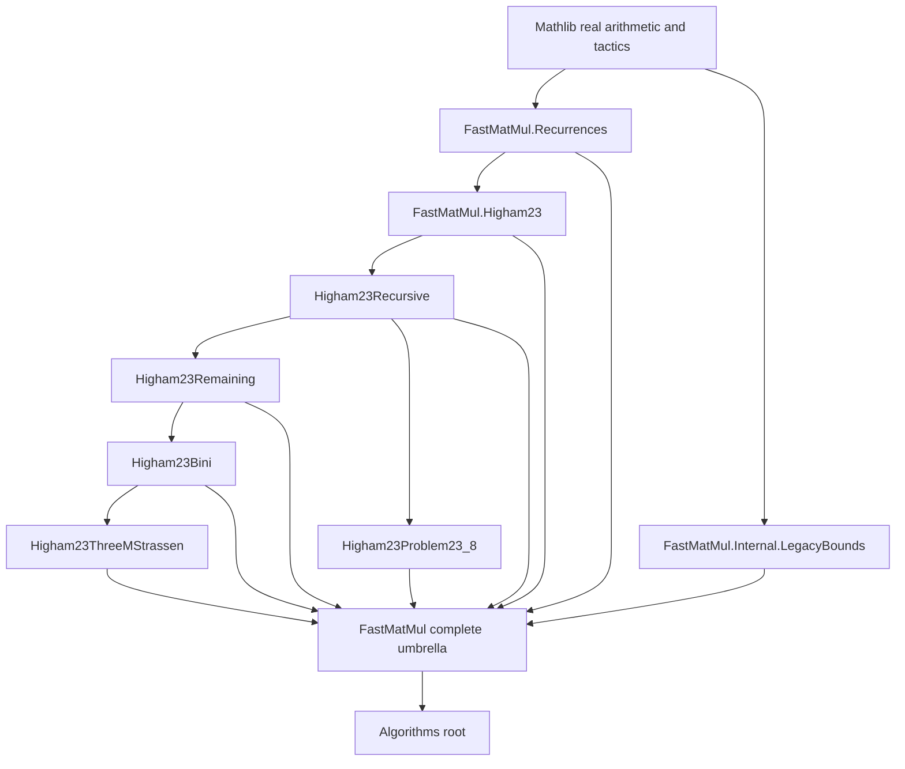

# Fast-matrix-multiplication umbrella migration

Date: 2026-07-23

Execution checkpoint: 2026-07-24. The extraction map, declaration inventory,
consumer search, and cycle analysis below were revalidated unchanged against
`4362b519c5bec29e0456fcb0a2cbee69924fa84e`, the Phase 6 commit pushed to
`main`. Phase 7 executes the immediate umbrella split first and then records a
separate exact declaration-level map for the required Chapter 23 source move.

## Scope and ordering

This is strict-order reorganization item 3. Its immediate batch turns
`NumStability.Algorithms.FastMatMul` from a declaration-bearing pseudo-umbrella
into a documented, declaration-free complete family surface.

The batch has one prerequisite-sensitive order:

1. extract the reusable recurrence API;
2. isolate the unsupported legacy bound placeholders;
3. redirect `Higham23` from the broad root to the recurrence leaf;
4. only then make `FastMatMul.lean` import every family child; and
5. collapse the root `Algorithms.lean` imports to the complete umbrella.

Reversing steps 3 and 4 creates an import cycle. The later physical move of the
six `Higham23*` modules into `Source.Higham.Chapter23` is a separate batch and
is required before item 3 can be called fully complete.

Execution base revision: `4362b519c5bec29e0456fcb0a2cbee69924fa84e`.
Declaration names, rather than mutable line numbers, are the authoritative
anchors. Public names and namespace `NumStability` remain unchanged.

## Current audit

At the execution base, `Algorithms.FastMatMul` has 250 lines and nine explicit
source declarations. Those declarations elaborate to 54 compiled constants:
47 public constants and seven internal constants generated by structures and
proof elaboration. Preservation evidence therefore compares all 54 constants,
not only the nine written anchors.
It is the only module listed in
`legacy.declaration_bearing_umbrellas`. Its opening notice already records that
four structures are dead, axiomatized legacy stand-ins and that Chapter 23 uses
only the two recurrence structures.

The declaration search confirms that:

- `Algorithms.FastMatMul.Higham23` is the only production consumer of any
  declaration from the current root;
- it references only `StrassenRecurrence` and
  `WinogradStrassenRecurrence`, in the two source-facing recurrence aliases at
  the end of that file;
- none of `StrassenErrorBound`, `WinogradStrassenErrorBound`,
  `conventional_componentwise_implies_cubic`,
  `WinogradInnerProductError`, `BilinearAlgorithmError`, or
  `ThreeMMethodError` has a production consumer; and
- all six `Higham23*` implementation files are currently unclassified and
  noncanonical source locators under `Algorithms`.

Endpoint status does not authorize deletion. The old root import remains a
supported surface, so the legacy declarations remain reachable through it.

## Exact extraction map

| Previous owner | Canonical owner | Base lines | Exact declaration anchor | Role |
| --- | --- | ---: | --- | --- |
| `Algorithms.FastMatMul` | `Algorithms.FastMatMul.Recurrences` | 67--88 | `StrassenRecurrence` through `strassen_recurrence_monotone` | reusable Strassen recurrence specification and monotonicity lemma |
| same | same | 140--143 | the individual structure `WinogradStrassenRecurrence` | reusable Winograd--Strassen recurrence specification |
| `Algorithms.FastMatMul` | `Algorithms.FastMatMul.Internal.LegacyBounds` | 111--125 | the individual structure `StrassenErrorBound` | unsupported, target-bearing legacy bound placeholder |
| same | same | 149--249 | `WinogradStrassenErrorBound` through `ThreeMMethodError` | remaining legacy aliases, placeholders, and the unused comparison lemma |
| old root path | `Algorithms.FastMatMul` | n/a | no declarations remain | complete and historical family umbrella |

The islands are intentionally non-contiguous. Extraction must select the named
declarations, not cut the old file at one line range and accidentally move
`WinogradStrassenRecurrence` into the legacy module.

`Recurrences` is a supported reusable leaf. Its module documentation describes
the recurrence API without repeating the stale first-edition Chapter 22
numbering. `Internal.LegacyBounds` retains the stale-numbering and unsupported
status warning. The `Internal` path is not a new supported import surface, even
though the complete historical umbrella continues to re-export those names.

No declaration is renamed, made private, or removed in this batch. In
particular, the unused legacy declarations may be removed only under a later
breaking-release policy.

## Import graph and cycle break



Edges point from prerequisite to consumer. Neither `Recurrences` nor
`Internal.LegacyBounds` imports the root umbrella.

## Narrow `Higham23` import

Replace exactly:

```text
import NumStability.Algorithms.FastMatMul
```

with:

```text
import NumStability.Algorithms.FastMatMul.Recurrences
```

`Higham23` retains its direct `DotProduct`, `Analysis.Norms`, asymptotics,
topology, and tactic imports. A probe build must make any tactic or foundational
dependency formerly supplied only by the old root explicit; it must not solve
an omitted dependency by restoring the umbrella import.

The two declarations protected by this edge are:

- `higham23_eq23_16_strassen_step`, which consumes `StrassenRecurrence`; and
- `higham23_winogradStrassen_error_step`, which consumes
  `WinogradStrassenRecurrence`.

No other `Higham23` declaration consumes a root-owned declaration.

## Complete umbrella contract

After the narrow import compiles, `Algorithms/FastMatMul.lean` contains only a
module docstring and these sorted, unique imports:

```text
import NumStability.Algorithms.FastMatMul.Higham23
import NumStability.Algorithms.FastMatMul.Higham23Bini
import NumStability.Algorithms.FastMatMul.Higham23Problem23_8
import NumStability.Algorithms.FastMatMul.Higham23Recursive
import NumStability.Algorithms.FastMatMul.Higham23Remaining
import NumStability.Algorithms.FastMatMul.Higham23ThreeMStrassen
import NumStability.Algorithms.FastMatMul.Internal.LegacyBounds
import NumStability.Algorithms.FastMatMul.Recurrences
```

Importing `Internal.LegacyBounds` is a documented exception to the normal rule
that public umbrellas omit `Internal`: the unchanged root path historically
exported these declarations. The umbrella promises compatibility, not that the
new internal path is supported.

`NumStability.Algorithms` then imports only
`NumStability.Algorithms.FastMatMul` for this family and removes its six direct
`FastMatMul.Higham23*` imports. This makes the complete-family contract real
and reduces top-level fanout. No compatibility-table row is needed because the
published root path does not change.

## Tests

Add and register the following isolated tests:

- `NumStabilityTest.Import.FastMatMulRecurrences` imports only
  `Algorithms.FastMatMul.Recurrences` and checks `StrassenRecurrence`,
  `strassen_recurrence_monotone`, and `WinogradStrassenRecurrence`.
- The planned `FastMatMulHigham23Narrow` smoke was superseded by the Phase 7
  old-only compatibility suite. In particular,
  `Compatibility.Source.Chapter23.AlgorithmsFastMatMulHigham23` imports only
  the historical wrapper and checks both Chapter 23 terminals and a retained
  legacy-root declaration.
- `NumStabilityTest.Import.FastMatMulAggregate` imports only
  `Algorithms.FastMatMul`. It checks all nine historical explicit declaration
  names and representative terminals from each current `Higham23*` child. This is
  both the complete-umbrella reachability test and the historical-surface test.

`FastMatMulLegacyBounds` directly imports `Internal.LegacyBounds` as an
explicitly internal structural smoke and checks all six retained declarations;
this test does not present the path as supported downstream API. The same
surface is also checked through every old-only Chapter 23 wrapper and the
historical complete umbrella.

Update `NumStabilityTest.Import.Algorithms` to check one FastMatMul family
terminal through the root Algorithms aggregate. A full build alone cannot
replace the isolated recurrence and aggregate tests.

## Manifest changes

In `docs/architecture/tiers.json`:

- classify `Algorithms.FastMatMul` as `aggregate`;
- classify `Algorithms.FastMatMul.Recurrences` as `reusable`;
- classify `Algorithms.FastMatMul.Internal.LegacyBounds` as `internal`; and
- classify each existing `Algorithms.FastMatMul.Higham23*` module as `source`
  for this transitional batch. Their paths remain noncanonical until the later
  Chapter 23 move, but they must no longer be unclassified.

In `docs/architecture/layout-exceptions.json`:

- add the complete-aggregate mapping
  `NumStability.Algorithms.FastMatMul -> NumStability.Algorithms.FastMatMul.`;
- remove `Algorithms.FastMatMul` from
  `legacy.declaration_bearing_umbrellas`, `legacy.missing_module_docstrings`,
  and `legacy.unclassified_modules`;
- remove all six `Higham23*` modules from `legacy.unclassified_modules` after
  their transitional `source` classification is recorded;
- retain those six modules in `legacy.noncanonical_modules` until the source
  migration lands; and
- add no exception for either new canonical declaration-bearing module.

`docs/architecture/COMPATIBILITY.md` is unchanged in this immediate batch.
Refresh direct-import ceilings and structural baselines only from measured
post-migration output. The expected reduction in `Algorithms.lean` imports is
not a license to lower a ceiling by guesswork.

## Build and quality gates

Build in dependency order:

```text
lake build NumStability.Algorithms.FastMatMul.Recurrences
lake build NumStability.Algorithms.FastMatMul.Internal.LegacyBounds
lake build NumStability.Algorithms.FastMatMul.Higham23
lake build NumStability.Algorithms.FastMatMul.Higham23Recursive
lake build NumStability.Algorithms.FastMatMul.Higham23Remaining
lake build NumStability.Algorithms.FastMatMul.Higham23Bini
lake build NumStability.Algorithms.FastMatMul.Higham23ThreeMStrassen
lake build NumStability.Algorithms.FastMatMul.Higham23Problem23_8
lake build NumStability.Algorithms.FastMatMul
lake build NumStability.Algorithms
```

Then build the isolated tests above and the final Phase 7 old-only suite, run
`lake test`, and run
`lake build NumStability NumStabilityTest`.

Completion evidence must also include:

1. a pre/post declaration inventory showing all 54 compiled constants owned by
   the nine old root declarations are preserved, together with an aggregate
   smoke proving all nine explicit names remain reachable from
   `Algorithms.FastMatMul`;
2. a direct-import graph proving `Higham23 -> Recurrences` and no family child
   imports the root umbrella;
3. declaration-free and sorted-aggregate checks for `FastMatMul.lean`;
4. `python tools/architecture/check_layout.py`;
5. `python tools/architecture/check_compatibility.py`;
6. `python tools/architecture/check_provenance.py`;
7. aggregate-order, strict source-boundary, baseline reproducibility, and
   notice-normalization dry-run checks; and
8. `git diff --check` with no generated output tracked.

The immediate umbrella batch is complete only when the old root has zero
declarations, `Higham23` builds without importing it, and the isolated
historical-surface test proves all old names remain available.

## Later Chapter 23 source migration required for full completion

The immediate batch deliberately does not move the six large source modules.
Classifying them as `source` while leaving them under `Algorithms` is a measured
transition, not the final architecture. Full completion of strict-order item 3
requires a second migration with:

- a declaration-free `Source.Higham.Chapter23` entry point;
- canonical source leaves using Chapter 23 locators and mathematical roles;
- import-only compatibility wrappers at every old `Algorithms.FastMatMul.Higham23*`
  path;
- canonical production consumers redirected to the source paths; and
- canonical-only, old-only, Chapter23-entry-point, and complete FastMatMul
  tests plus compatibility-manifest rows.

The preliminary physical map is:

| Current module | Later canonical ownership |
| --- | --- |
| `Algorithms.FastMatMul.Higham23Problem23_8` | `Source.Higham.Chapter23.Problem08` |
| `Algorithms.FastMatMul.Higham23Recursive` | Chapter 23 recursive-Strassen execution and error-analysis leaves |
| `Algorithms.FastMatMul.Higham23Remaining` | split into Winograd--Strassen, Miller equation-(23.11), and associated recurrence/error leaves; `Remaining` is not a canonical filename |
| `Algorithms.FastMatMul.Higham23Bini` | `Source.Higham.Chapter23.BiniLotti` family |
| `Algorithms.FastMatMul.Higham23ThreeMStrassen` | `Source.Higham.Chapter23.ThreeMStrassen` family |
| `Algorithms.FastMatMul.Higham23` | split by its existing Winograd inner-product, conventional multiplication, block algorithms, bilinear algorithms, 3M, and recurrence-coefficient sections |

The exact declaration-level Chapter 23 map must be written before that second
batch. In particular, the 1,617-line `Higham23` and 1,650-line
`Higham23Remaining` files must not be moved wholesale to vague `Core` or
`Remaining` source names. The current import chain is preserved by wrappers
until the split compiles.

Only after the Chapter 23 source entry point exists, all old paths are tested
compatibility wrappers, and the six noncanonical exceptions are removed may
strict-order item 3 be reported fully complete.

Public declaration renames, legacy-placeholder deletion, wrapper removal, and
conversion to `module`/`public import` syntax are outside both mechanical moves
unless separately authorized.
